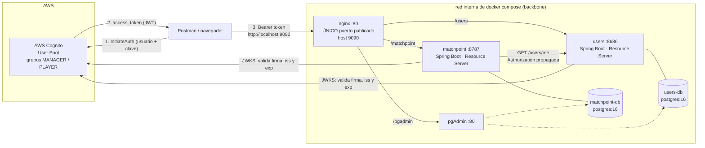

# MatchPoint — Reservas de canchas + Torneos 🏀

**Asignatura:** Arquitectura Empresarial · **Periodo:** 2026-01 · **NRC:** 1473
**Proyecto:** MatchPoint — reserva de canchas y torneos de eliminación directa

| Integrante | Rol en el proyecto |
|---|---|
| Josué Herrera (`jxherrera`) | Backend: microservicio `matchpoint`, gateway, logging, tests |
| Fernando Socasi | Backend: microservicio `users`, seguridad, autenticación, tests |

**URL desplegada:** _no aplica — el sistema corre en local con `docker compose`._

---

## 1. Qué es esto

Un **monorepo** con dos microservicios independientes detrás de un API Gateway. Cada uno
tiene **su propia base de datos PostgreSQL** y ninguno toca la del otro: cuando `matchpoint`
necesita un dato de `users`, se lo **pide por HTTP** con el token del usuario propagado.

| Componente | Qué hace |
|---|---|
| `users/` | Asocia el `sub` de Cognito con el perfil del usuario (nombre, correo, teléfono). Base propia: `users-db`. |
| `matchpoint/` | Dominio del proyecto: canchas, reservas, torneos, equipos y partidos. Base propia: `matchpoint-db`. |
| `nginx/` | API Gateway / reverse proxy. **Único** servicio con puerto publicado. |
| `pgadmin/` | Config del explorador de BD, con **las dos** conexiones ya registradas. |
| `postman/` | Colección + environment, apuntando a nginx. |

### Diagrama de arquitectura



> Las líneas punteadas de pgAdmin son solo de inspección manual. **Ningún microservicio
> tiene credenciales de la base del otro.**

### Estructura del monorepo

```
.
├── users/                     microservicio de usuarios
│   ├── Dockerfile
│   └── src/main/kotlin/com/pucetec/users/
│       ├── audit/             AuditLog + AuditService (quién, qué, cuándo)
│       ├── config/            SecurityConfig (Cognito -> ROLE_*)
│       ├── controllers/       capa web, sin lógica de negocio
│       ├── dto/               frontera: Request / Response
│       ├── entities/          modelo persistente
│       ├── exceptions/        excepciones + GlobalExceptionHandler
│       ├── logging/           estándar de logging (filtro, MDC, helpers)
│       ├── mappers/           @Component: entity <-> dto
│       ├── repositories/      persistencia (Spring Data)
│       └── services/          lógica de dominio
├── matchpoint/                microservicio del proyecto (misma estructura + clients/)
├── nginx/
│   ├── nginx.conf
│   └── proxy_headers.conf
├── pgadmin/
│   ├── servers.json           las dos conexiones ya registradas
│   └── pgpass.example         plantilla (pgpass real está en .gitignore)
├── postman/
│   ├── matchpoint.postman_collection.json
│   └── matchpoint.postman_environment.json
├── docker-compose.yml
├── .env.example               plantilla sin secretos (.env está en .gitignore)
└── README.md
```

**Arquitectura en capas** dentro de cada microservicio: `controller → service → repository`.
Las dependencias apuntan hacia adentro; el controlador no consulta repositorios ni decide
reglas de negocio, y los DTOs viven en la frontera.

**Todo el código está en inglés** — endpoints, tablas, columnas, clases, métodos, variables,
nombres de eventos de log y mensajes de error de la API. Lo único en español es esta
documentación y los comentarios que explican una decisión.

---

## 2. Cómo levantar todo

```bash
cp .env.example .env
```

Edita `.env` con tu User Pool de Cognito y tus claves de base de datos. Después:

```bash
cp pgadmin/pgpass.example pgadmin/pgpass && chmod 600 pgadmin/pgpass
```

Pon en `pgadmin/pgpass` las mismas claves que pusiste en `.env` (así pgAdmin abre las dos
conexiones sin pedir nada). Y ya:

```bash
docker compose up -d --build
```

Cuando todo esté `healthy`:

| Qué | Dónde |
|---|---|
| Gateway | http://localhost:9090 |
| Microservicio `users` | http://localhost:9090/users |
| Microservicio `matchpoint` | http://localhost:9090/matchpoint |
| Explorador de BD (pgAdmin) | http://localhost:9090/pgadmin/ |
| Logs en vivo | `docker compose logs -f` |

**El puerto de host es 9090** (variable `GATEWAY_PORT` en `.env`), elegido para no chocar con
otros demos. Comprobar el estado:

```bash
docker compose ps
```

### Solo nginx publica puerto

`docker compose ps` muestra **un único** servicio con `PORTS` mapeado al host: `nginx`. Los dos
microservicios, las dos bases y pgAdmin usan `expose:` y solo son alcanzables dentro de la red
interna. Verificación directa:

```bash
curl -s -o /dev/null -w "%{http_code}\n" http://localhost:9090/matchpoint/courts && curl -s --max-time 3 http://localhost:8787/matchpoint/courts; echo "exit=$?"
```

La primera responde `200`; la segunda falla, porque el puerto interno no está publicado.

A las bases tampoco se llega desde el host: se inspeccionan con **pgAdmin, que también entra por
el gateway** (`http://localhost:9090/pgadmin/`) y ya trae las dos conexiones registradas. Entre
contenedores se hablan por el DNS interno de Compose (`users-db:5432`, `matchpoint-db:5432`),
como se ve en `DB_URL`.

---

## 3. Base de datos: una por microservicio

*Database-per-service*, sin excepciones:

| Microservicio | Contenedor | Base | Usuario | Volumen |
|---|---|---|---|---|
| `users` | `users-db` | `users_db` | `users_app` | `users_data` |
| `matchpoint` | `matchpoint-db` | `matchpoint_db` | `matchpoint_app` | `matchpoint_data` |

El modelo entidad-relación de las dos bases, con cardinalidades y diagramas, está en
[`docs/MODELO-ER.md`](docs/MODELO-ER.md) (los diagramas exportados, en [`docs/er/`](docs/er)).

Credenciales, base y volumen **distintos** por servicio. La cadena de conexión de cada
microservicio (`DB_URL` en el `docker-compose.yml`) apunta **solo** a la suya, no hay `JOIN`
entre dominios ni claves foráneas cruzadas. Las dos son **PostgreSQL 16 con versión fija**
(`postgres:16-alpine`), nunca `latest` y nunca base en memoria.

Cada base tiene `healthcheck` con `pg_isready` y cada microservicio depende de la suya con
`condition: service_healthy`. **Entre microservicios la dependencia es `service_started`**:
si `users` tarda, `matchpoint` arranca igual y la llamada devuelve `503` hasta que el vecino
responda; exigir `service_healthy` convertiría una dependencia de datos en una de arranque.

### Tablas

`matchpoint` (5 tablas de dominio + auditoría):

```
courts      1:N reservations    (una cancha, muchas reservas)
courts      1:N tournaments     (una cancha puede ser sede; opcional)
tournaments 1:N teams
tournaments 1:N matches
teams (N:M) teams vía matches   ('matches' es la entidad asociativa: 2 equipos por partido)
audit_log                       (auditoría de las entidades principales)
```

`users`: `users` + `audit_log`.

### Datos de prueba

Cada servicio siembra su base en el arranque con `src/main/resources/data.sql`
(`spring.jpa.defer-datasource-initialization=true` + `spring.sql.init.mode=always`). Los
`INSERT` usan `ON CONFLICT DO NOTHING`, así que reiniciar no duplica nada.

Están sembrados a propósito los casos que disparan **cada** validación de negocio:

| Dato sembrado | Qué demuestra |
|---|---|
| Cancha 3 inactiva | `POST /reservations` → `409` |
| Cancha 4 de `manager_ana` | `PATCH /courts/4` → `403` por propiedad |
| Reserva 1 ocupando una franja | misma franja → `409` por solapamiento |
| Reserva 4 de `player_luis` | `DELETE /reservations/4` → `403` por propiedad |
| Torneo 1 con 3 de 4 equipos | `POST /tournaments/1/start` → `409` |
| Torneo 3 ya `FINISHED` con campeón | inscribir equipo → `409` |
| Torneo 4 de `manager_ana` | `start` → `403` por propiedad |

---

## 4. Cognito (autenticación y autorización)

Todo acceso pasa por **AWS Cognito**. No hay JWT propio, ni sesiones, ni Basic Auth, ni
usuarios en memoria.

| Parámetro | Valor |
|---|---|
| Región | `us-east-1` (variable `COGNITO_REGION`) |
| User Pool ID | `us-east-1_JDqEph0S3` (variable `COGNITO_USER_POOL_ID`) |
| Issuer | `https://cognito-idp.${COGNITO_REGION}.amazonaws.com/${COGNITO_USER_POOL_ID}` |
| App Client | `matchpoint-client` — `1n48tn47edu17qg12cj1hsohfm` (variable `COGNITO_APP_CLIENT_ID`, **solo la usa Postman**) |
| Flujo del App Client | inicio de sesión basado en opciones (`USER_AUTH`) **con client secret** |
| Grupos | `MANAGER`, `PLAYER` |

Se usa el App Client que **ya existía** en el User Pool; no se creó ninguno aparte para las
pruebas. Como tiene client secret, toda llamada a Cognito va firmada con
`SECRET_HASH = Base64(HMAC-SHA256(username + clientId, clientSecret))`, y como su flujo es
`USER_AUTH`, el login son dos llamadas: `InitiateAuth` con `PREFERRED_CHALLENGE: PASSWORD`
devuelve el reto y una `Session`, y `RespondToAuthChallenge` la responde con la clave. Las dos
las hace la carpeta `0` de la colección de Postman.

**El client secret no vive en el repositorio.** No está en `.env` ni en el código: el backend
no pide tokens, solo los valida contra el JWKS. El secreto se copia a mano en el environment
de Postman (`cognitoClientSecret`, de tipo *secret*) desde
*Cognito → Clientes de aplicación → matchpoint-client → Secretos del cliente*.

**Los dos microservicios arman el issuer con las mismas dos variables de entorno**, así que
resuelven exactamente el mismo valor: un token que uno acepta, el otro también. Los valores
viven en `.env`; `.env.example` se versiona sin secretos.

Cada servicio es un **Resource Server**: descarga el JWKS del issuer y valida firma, emisor y
expiración de cada token. El mapeo de rol es el mismo en ambos:

```kotlin
// claim cognito:groups -> autoridad de Spring Security
groups.map { SimpleGrantedAuthority("ROLE_${it.uppercase()}") }   // MANAGER -> ROLE_MANAGER
```

### Roles y permisos

| Rol | Puede |
|---|---|
| **MANAGER** | Crear/editar **sus** canchas · crear torneos, arrancar el cuadro, programar y puntuar partidos de **sus** torneos · listar, ver y borrar perfiles de `users` |
| **PLAYER** | Reservar canchas, ver/cancelar **sus** reservas · inscribir y retirar equipos · ver y editar **su** perfil |

Hay **dos capas de 403**:

1. **Por rol** — la decide Spring Security en la `SecurityFilterChain` de cada servicio.
2. **Por propiedad** — la decide el servicio: `findCourtOwnedBy`, `findReservationOwnedBy`,
   `findTournamentOwnedBy`. Tu rol te deja hacer la acción, pero el recurso no es tuyo.

El `managerUser` de una cancha o torneo y el `ownerUser` de una reserva salen del claim
`username` del token. **Los DTOs de request ni siquiera tienen esos campos.**

### Usuarios de Cognito para la demo

Crea y confirma en el User Pool **un usuario por rol**, con estos nombres (son los que usan
los datos sembrados para las comprobaciones de propiedad):

| Usuario | Grupo |
|---|---|
| `manager_josue` | `MANAGER` |
| `player_fernando` | `PLAYER` |

### Qué código responde cada uno

| Código | Significa | ¿Quién lo pone? |
|---|---|---|
| `401` | No sé quién eres (sin token, expirado o manipulado) | Spring Security |
| `403` (rol) | Tu rol no puede hacer esto | Spring Security |
| `403` (propiedad) | Es tuyo el rol… pero no el recurso | **el service** |
| `404` | No existe | el service |
| `409` | El estado no lo permite (cancha ocupada, torneo lleno/cerrado, partido ya jugado) | el service |
| `503` | El microservicio `users` no responde | el service |

---

## 5. Comunicación entre microservicios

Es **síncrona por HTTP**, por el **nombre de servicio de Compose**, nunca por `localhost` ni
por IP:

```
matchpoint  ──HTTP GET http://users:8686/users/me──►  users
            ◄──────── perfil del usuario ───────────
```

- La URL base llega por variable de entorno (`USERS_SERVICE_URL: http://users:8686`).
- **La identidad viaja en el propio token:** `UsersClient` reenvía la cabecera
  `Authorization` del usuario que hizo la petición, así que `users` aplica sus mismas reglas
  de seguridad. Nunca se fabrica un token de servicio.
- Timeouts explícitos de 3 s (`services.users.timeout-millis`). Si `users` no responde,
  `matchpoint` devuelve `503` y se recupera solo.

Dónde se usa:

| Endpoint de `matchpoint` | Llamada a `users` | Para qué |
|---|---|---|
| `POST /matchpoint/reservations` | `GET /users/me` | Regla de negocio: **no se reserva sin perfil registrado**. Sin perfil → `409`. Además guarda el `ownerName` que devolvió `users`. |
| `GET /matchpoint/me` | `GET /users/me` | Devuelve la identidad del token **y** el perfil que respondió el otro microservicio. Es la prueba en vivo más corta de que el token cruza nginx y salta de un micro al otro. |

---

## 6. Endpoints

Todo pasa por nginx: `http://localhost:9090`.

### Microservicio `users`

| Método | Endpoint | Sin token | Rol correcto | Rol equivocado |
|---|---|---|---|---|
| `POST` | `/users/me` | `401` | `201` (cualquiera autenticado) | — |
| `GET` | `/users/me` | `401` | `200` | — |
| `PUT` | `/users/me` | `401` | `200` | — |
| `GET` | `/users` | `401` | `200` (MANAGER) | `403` (PLAYER) |
| `GET` | `/users/{id}` | `401` | `200` (MANAGER) | `403` |
| `DELETE` | `/users/{id}` | `401` | `204` (MANAGER) | `403` |
| `GET` | `/users/cognito/{cognitoId}` | `401` | `200` (autenticado) | — |

### Microservicio `matchpoint`

#### Canchas — tabla `courts`

| Método | Endpoint | Sin token | Rol correcto | Rol equivocado |
|---|---|---|---|---|
| `GET` | `/matchpoint/courts` (`?sector=&sport=`) | `200` | — | — |
| `GET` | `/matchpoint/courts/available` (`?sector=&sport=&startsAt=&durationMinutes=`) | `200` | — | — |
| `GET` | `/matchpoint/courts/{id}` | `200` | — | — |
| `POST` | `/matchpoint/courts` | `401` | `201` (MANAGER) | `403` (PLAYER) |
| `PATCH` | `/matchpoint/courts/{id}` | `401` | `200` (MANAGER dueño) | `403` |

#### Reservas — tabla `reservations`

| Método | Endpoint | Sin token | Rol correcto | Rol equivocado |
|---|---|---|---|---|
| `POST` | `/matchpoint/reservations` | `401` | `201` (PLAYER) | `403` (MANAGER) |
| `GET` | `/matchpoint/reservations/me` | `401` | `200` (PLAYER) | `403` |
| `GET` | `/matchpoint/reservations/{id}` | `401` | `200` (PLAYER dueño) | `403` |
| `DELETE` | `/matchpoint/reservations/{id}` | `401` | `204` (PLAYER dueño) | `403` |

#### Torneos — tabla `tournaments`

| Método | Endpoint | Sin token | Rol correcto | Rol equivocado |
|---|---|---|---|---|
| `GET` | `/matchpoint/tournaments` | `200` | — | — |
| `GET` | `/matchpoint/tournaments/{id}` (progreso + cuadro) | `200` | — | — |
| `POST` | `/matchpoint/tournaments` | `401` | `201` (MANAGER) | `403` (PLAYER) |
| `POST` | `/matchpoint/tournaments/{id}/start` | `401` | `200` (MANAGER dueño) | `403` |

#### Equipos — tabla `teams`

| Método | Endpoint | Sin token | Rol correcto | Rol equivocado |
|---|---|---|---|---|
| `GET` | `/matchpoint/tournaments/{id}/teams` | `200` | — | — |
| `GET` | `/matchpoint/tournaments/{id}/teams/{teamId}` | `200` | — | — |
| `POST` | `/matchpoint/tournaments/{id}/teams` | `401` | `201` (PLAYER) | `403` (MANAGER) |
| `DELETE` | `/matchpoint/tournaments/{id}/teams/{teamId}` | `401` | `204` (PLAYER dueño) | `403` |

#### Partidos — tabla `matches`

| Método | Endpoint | Sin token | Rol correcto | Rol equivocado |
|---|---|---|---|---|
| `GET` | `/matchpoint/tournaments/{id}/matches` | `200` | — | — |
| `GET` | `/matchpoint/matches/{matchId}` | `200` | — | — |
| `PATCH` | `/matchpoint/matches/{matchId}/schedule` | `401` | `200` (MANAGER dueño) | `403` |
| `PATCH` | `/matchpoint/matches/{matchId}/score` | `401` | `200` (MANAGER dueño) | `403` |

#### Identidad

| Método | Endpoint | Sin token | Con token |
|---|---|---|---|
| `GET` | `/matchpoint/me` | `401` | `200` (username, sub, groups **y perfil traído de `users`**) |

---

## 7. Estándar de logging

**Lo que se busca:** que al disparar una petición desde Postman, `docker compose logs -f`
muestre **inmediatamente** qué pasó, quién lo hizo y qué SQL se ejecutó.

### a) Formato

Nada de JSON. Cada log ocupa **una sola línea**, con campos separados por ` | `, en este
orden fijo:

```
<timestamp> | <LEVEL> | <servicio> | sub=<cognito-sub|anonimo> | <logger> | event=<evento> | msg=<mensaje> | <clave=valor ...>
```

Ejemplo real de una llamada desde Postman:

```
2026-08-03T21:40:11.301-05:00 | INFO  | matchpoint | sub=a1b2c3d4-e5f6-7890-abcd-ef1234567890 | c.p.m.logging.ApiLoggingFilter        | event=http.request | msg=POST /matchpoint/reservations
2026-08-03T21:40:11.355-05:00 | INFO  | matchpoint | sub=a1b2c3d4-e5f6-7890-abcd-ef1234567890 | c.p.m.clients.UsersClient             | event=users.profile.requested | msg=Calling users microservice | endpoint="GET /users/me"
2026-08-03T21:40:11.482-05:00 | INFO  | matchpoint | sub=a1b2c3d4-e5f6-7890-abcd-ef1234567890 | c.p.m.services.ReservationService     | event=reservation.created | msg=Reservation created | reservationId=17 courtId=5 ownerUser=player_fernando
2026-08-03T21:40:11.495-05:00 | INFO  | matchpoint | sub=a1b2c3d4-e5f6-7890-abcd-ef1234567890 | c.p.m.logging.ApiLoggingFilter        | event=http.response | msg=201 POST /matchpoint/reservations
2026-08-03T21:41:02.118-05:00 | WARN  | matchpoint | sub=a1b2c3d4-e5f6-7890-abcd-ef1234567890 | c.p.m.exceptions.GlobalExceptionHandler | event=state.conflict | msg=Court 5 is already booked on that time slot | status=409
2026-08-03T21:42:40.902-05:00 | WARN  | users      | sub=anonimo | c.p.u.logging.LoggingAuthenticationEntryPoint | event=auth.rejected | msg=Token missing, invalid or expired | reason="Full authentication is required"
```

Reglas:

- **Orden y separador fijos.** Siempre ` | `, siempre en el mismo orden, **nunca se omite un
  campo**. Sin usuario autenticado: `sub=anonimo`.
- `timestamp` y `LEVEL` **los pone el framework** (`%d` y `%-5level` del patrón), no se
  escriben a mano. `%d` en ISO-8601 con milisegundos; nivel en ancho fijo de 5.
- `<servicio>` sale de `${spring.application.name}`, tampoco se escribe a mano.
- `sub` es el **`sub` del token de Cognito**. Lo pone en el **MDC** un filtro que lo lee del
  JWT ya validado; no se inventa ningún id propio.
- Los pares extra van al final como `clave=valor` separados por espacio, con la clave en
  inglés. Si el valor tiene espacios, entre comillas: `title="my first entry"`.
- `msg` es texto corto, en inglés y sin saltos de línea. El stacktrace va inmediatamente
  después de la línea (única excepción a la regla de una sola línea).
- Prohibido `|` dentro de un valor: se reemplaza por `/`.

Configuración (idéntica en los dos servicios, en `application.yaml`):

```properties
logging.pattern.console=%d{yyyy-MM-dd'T'HH:mm:ss.SSSXXX} | %-5level | ${spring.application.name} | sub=%X{sub:-anonimo} | %logger{40} | %msg%n
```

El helper `logLine(event, msg, vararg campos)` (`logging/LogEvents.kt`) arma la parte final y
se encarga de las comillas, del `|` prohibido y de descartar los campos nulos.

### b) Niveles

| Nivel | Cuándo |
|---|---|
| `ERROR` | Falla que impide completar la operación. Siempre con excepción y stacktrace. |
| `WARN` | Anomalía recuperable: token expirado, validación de negocio rechazada, rol denegado, vecino caído. |
| `INFO` | Eventos de negocio: creación, actualización, borrado, cambio de estado, llamada saliente a otro servicio. |
| `DEBUG` | Detalle técnico: SQL, listados, decisiones internas. **Activo** durante la evaluación. |
| `TRACE` | Solo los parámetros de las sentencias de Hibernate. |

### c) Nomenclatura de eventos

`event` en formato `<recurso>.<acción>`, en minúsculas y en inglés:

`http.request` · `http.response` · `auth.rejected` · `authz.denied` ·
`user.created` · `user.updated` · `user.deleted` · `user.not_found` · `user.create.failed` ·
`court.created` · `court.updated` · `court.listed` · `court.availability.checked` ·
`reservation.created` · `reservation.cancelled` · `reservation.listed` ·
`tournament.created` · `tournament.started` · `tournament.finished` · `tournament.listed` ·
`team.registered` · `team.withdrawn` · `team.listed` ·
`match.scheduled` · `match.scored` · `match.advanced` · `match.listed` ·
`users.profile.requested` · `users.profile.received` · `users.profile.missing` · `users.profile.failed` ·
`resource.not_found` · `ownership.denied` · `request.rejected` · `state.conflict` · `users.unavailable` ·
`audit.recorded`

### d) Toda petición deja rastro

Se implementa **una sola vez por servicio**, no con `log.info` repartidos por los
controladores:

- `logging/ApiLoggingFilter` se instala dentro de la cadena de Spring Security, justo después
  del filtro que valida el Bearer token. Escribe la línea de entrada (`event=http.request`) y
  la de salida (`event=http.response` con el código HTTP), y pone el `sub` en el MDC. Las
  peticiones que terminan en `401` (sin token) o `403` (rol equivocado) también pasan por
  aquí.
- `logging/LoggingAuthenticationEntryPoint` cubre el único hueco: un token **manipulado o
  expirado** muere antes de llegar al filtro, así que ese `401` se registra desde aquí.
- `logging/LoggingAccessDeniedHandler` añade el `event=authz.denied` que explica *por qué* se
  negó un `403`.
- `GlobalExceptionHandler` deja un `WARN` por cada validación de negocio rechazada.

### e) Logging de base de datos — dos capas, en las dos bases

**1. Motor (PostgreSQL).** En el `docker-compose.yml`, en `users-db` **y** en `matchpoint-db`:

```yaml
command:
  - postgres
  - -c
  - log_statement=all
  - -c
  - log_duration=on
  - -c
  - log_min_duration_statement=0
  - -c
  - "log_line_prefix=%m [%p] %u@%d app=%a "
  - -c
  - log_connections=on
  - -c
  - log_disconnections=on
```

**2. Aplicación (Spring Boot / JPA).** En los dos `application.yaml`:

```properties
logging.level.org.hibernate.SQL=DEBUG
logging.level.org.hibernate.orm.jdbc.bind=TRACE
spring.jpa.properties.hibernate.format_sql=true
spring.jpa.properties.hibernate.generate_statistics=true
```

> Con `format_sql=true` (que es lo que pide la configuración de referencia de la rúbrica)
> Hibernate imprime el SQL indentado en varias líneas. Junto con el stacktrace de una
> excepción, es la única salida multilínea del sistema: **las líneas del estándar
> (`event=`) siempre ocupan una sola.** En el log del motor de PostgreSQL el mismo SQL sí
> aparece en una línea, como `execute <unnamed>: select ...`.

**Auditoría.** Cada servicio tiene una tabla `audit_log` con **quién** (`user_sub` del token
de Cognito + `user_name`), **qué** (`entity_name`, `entity_id`, `action` = `INSERT`/`UPDATE`/
`DELETE`), **cuándo** (`created_at`) y los **valores anteriores y nuevos** (`old_values`,
`new_values`). La escribe `audit/AuditService`, invocado desde los services en cada mutación.

### f) Datos sensibles

Nunca se loguean contraseñas, tokens completos, ni correos o teléfonos enteros. `LogEvents.kt`
expone `maskEmail` y `maskPhone`, que también se aplican a los valores guardados en
`audit_log`:

```
juan.perez@puce.edu.ec  ->  j***@puce.edu.ec
0999555666              ->  ****5666
```

### g) Salida

**Todo va a `stdout`** — los dos microservicios, nginx (`access_log /dev/stdout` con un
formato alineado al estándar) y las dos bases. Nada se escribe solo a un archivo dentro del
contenedor, que es justamente lo que impediría verlo con `docker compose logs -f`.

---

## 8. Logs durante la demo

Una terminal abierta al lado de Postman:

```bash
docker compose logs -f
```

Para aislar un servicio:

```bash
docker compose logs -f matchpoint
```

Ver solo el SQL de una base:

```bash
docker compose logs -f matchpoint-db
```

---

## 9. Explorador de base de datos

**pgAdmin**, como servicio del `docker-compose.yml`, en http://localhost:9090/pgadmin/ — va
detrás de nginx a propósito, para que el proxy siga siendo el único servicio con puerto
publicado.

`pgadmin/servers.json` deja **las dos conexiones ya registradas** (`users-db` y
`matchpoint-db`) bajo el grupo *MatchPoint*, y `pgadmin/pgpass` (que no se versiona) guarda
las claves para que no pida nada al conectarse.

Prueba en vivo: crea una reserva desde Postman y haz

```sql
SELECT * FROM reservations ORDER BY id DESC LIMIT 5;
```

en `matchpoint-db`; la fila recién creada aparece ahí, junto con su rastro en `audit_log`.

---

## 10. Tests y cobertura

```bash
cd users      && ./gradlew test        # 57 tests
cd matchpoint && ./gradlew test        # 157 tests
```

Los tests **no necesitan AWS ni Postgres**: el `JwtDecoder` se sustituye por un mock y los
JWT se fabrican con `jwt()` de `spring-security-test`; los pocos tests que levantan el
contexto usan una base en memoria declarada **solo** en `src/test/resources`.

Incluyen tests unitarios de los services y **de integración de los endpoints**
(`@WebMvcTest` + `MockMvc`), cubriendo casos felices, de error y de autorización — hay tests
que verifican que un endpoint protegido **rechaza** una petición sin token (`401`) y otra con
token del rol equivocado (`403`), en los dos microservicios.

### Cobertura

Se mide con el coverage del IDE (*Run with Coverage* en IntelliJ) y además está automatizada
con JaCoCo, con el umbral puesto en 100 %:

```bash
cd users      && ./gradlew check       # falla si la cobertura de líneas baja del 100 %
cd matchpoint && ./gradlew check
```

El reporte HTML queda en `build/reports/jacoco/test/html/index.html` de cada servicio (no se
versiona: se regenera con `./gradlew test`). Capturas del coverage del IDE:
[`users`](docs/coverage/users-coverage.png) · [`matchpoint`](docs/coverage/matchpoint-coverage.png).

**Lo que se deja fuera de la cuenta** (permitido por la rúbrica): clases de configuración
(`config/`), DTOs sin lógica (`dto/`, `clients/UserProfile`), entidades sin comportamiento
(`entities/`, `audit/AuditLog`), enums (`enums/`) y las clases `*Application`. Todo lo demás
—controladores, services, mappers, filtros de logging, cliente HTTP, auditoría y manejo de
excepciones— está al **100 % de líneas**.

Por eso hay dos números, y los dos son correctos:

| Medición | users | matchpoint | Qué cuenta |
|---|---|---|---|
| JaCoCo (`./gradlew check`) | **100 %** | **100 %** | Solo el código propio, con las exclusiones de arriba |
| Coverage del IDE | 99.3 % | 99.8 % | **Todo**, incluidas las clases excluidas |

Lo único que el IDE marca sin cubrir es el `main()` de las clases `Application` y los
constructores sintéticos de las entidades — exactamente las dos categorías que la rúbrica
permite dejar fuera.

---

## 11. Colección de Postman

- [`postman/matchpoint.postman_collection.json`](postman/matchpoint.postman_collection.json)
- [`postman/matchpoint.postman_environment.json`](postman/matchpoint.postman_environment.json)

Importa las dos y selecciona el environment. Rellena `cognitoClientSecret`, `managerPassword` y
`playerPassword` (no se versiona ningún valor real; el `cognitoClientId` ya viene puesto,
porque no es secreto). Después basta el **Collection Runner** de arriba a abajo.

La colección **apunta a nginx** (`{{baseUrl}}` = `http://localhost:9090`), nunca a los puertos
internos. Está organizada en carpetas:

| Carpeta | Qué cubre |
|---|---|
| `0. Cognito` | Login `USER_AUTH` (dos pasos, firmado con `SECRET_HASH`) de los dos roles; guarda los tokens solo, con un script de test |
| `1. users` | Perfiles: alta, consulta, actualización, listado (MANAGER), `403` y `401` |
| `2. canchas` | Alta, filtros, detalle, actualización, `400`, `401`, `403` por rol y `403` por propiedad |
| `3. reservas` | Alta (con la llamada a `users`), solapamiento `409`, cancha inactiva `409`, `403`, cancelación |
| `4. torneo completo` | Torneo de punta a punta: crear → inscribir → arrancar → programar → puntuar → campeón, con `400`/`403`/`409` en el medio |
| `5. identidad` | `/me` de los dos roles, sin token (`401`) y con token manipulado (`401`) |
| `6. limpieza` | Deja el estado listo para volver a ejecutar la colección entera |

Cada request tiene aserciones `pm.test`, y los ids (`courtId`, `tournamentId`,
`reservationId`, `teamAId`, `finalMatchId`) se guardan solos entre pasos.

---

## 12. Guion de la demo

Guion completo, paso a paso y con los comandos exactos: [`docs/DEMO.md`](docs/DEMO.md).
En resumen:

1. `docker compose ps` — todo `healthy`, la API con un solo punto de entrada.
2. Diagrama de arquitectura y decisiones (secciones 1, 3 y 5 de este README).
3. Postman: carpeta `0` (token de Cognito) y luego el flujo completo de negocio.
4. Base de datos: el modelo entidad-relación ([`docs/MODELO-ER.md`](docs/MODELO-ER.md)) y la
   fila recién creada en pgAdmin (`http://localhost:9090/pgadmin/`), en la base del
   microservicio que corresponde.
5. `docker compose logs -f` al lado: se ven la línea de entrada, el evento de negocio, el SQL
   y la línea de salida con el código HTTP. Repetir con un `401` y con un `403`.
6. `./gradlew test` y la cobertura del IDE en los dos servicios.
