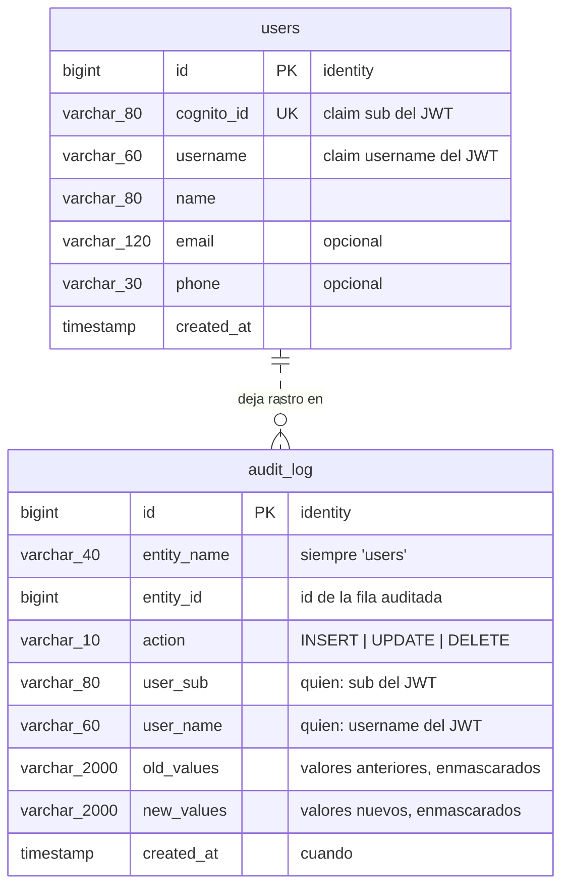
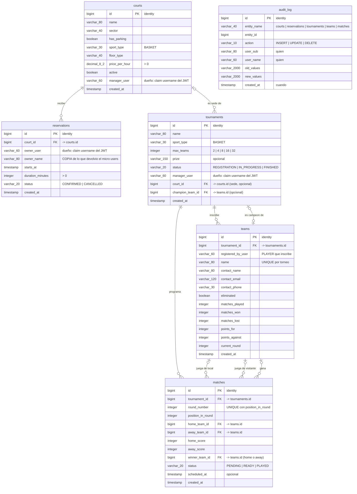
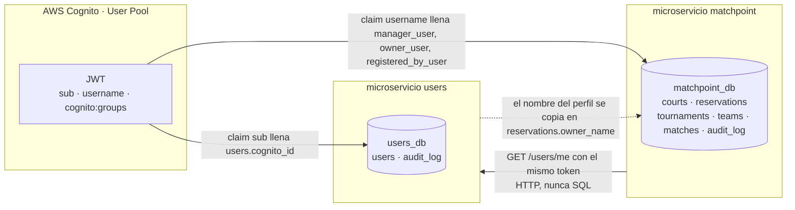

# MatchPoint · Modelo entidad-relación

Dos bases PostgreSQL 16 **independientes**, una por microservicio (*database-per-service*).
No hay ninguna clave foránea entre ellas: el dato ajeno viaja por HTTP, nunca por `JOIN`.

| Base | Microservicio | Tablas |
|---|---|---|
| `users_db` | `users` | `users`, `audit_log` |
| `matchpoint_db` | `matchpoint` | `courts`, `reservations`, `tournaments`, `teams`, `matches`, `audit_log` |

Los tres diagramas de este documento están exportados en [`er/`](er) como `.svg` y `.png`
(listos para pegar en el informe), junto a su fuente `.mmd`.

El DDL en ejecución lo genera Hibernate (`ddl-auto=update`); el modelo escrito a mano está en
[`users/src/main/resources/db/users_schema.sql`](../users/src/main/resources/db/users_schema.sql)
y [`matchpoint/src/main/resources/db/matchpoint_schema.sql`](../matchpoint/src/main/resources/db/matchpoint_schema.sql).

---

## 1. Base `users_db` (microservicio `users`)



> `audit_log` **no** tiene FK a `users`: apunta a cualquier entidad con el par
> (`entity_name`, `entity_id`) y las filas de auditoría deben sobrevivir al borrado del perfil.
> Por eso la relación se dibuja punteada (lógica, no declarada en el motor).

Regla del dominio: **un usuario de Cognito = un perfil**, garantizado por el `UNIQUE` de
`cognito_id`. El perfil no guarda contraseñas ni roles: la identidad y los grupos
(`MANAGER` / `PLAYER`) viven en el User Pool y llegan dentro del token.

---

## 2. Base `matchpoint_db` (microservicio `matchpoint`)



### Cardinalidades, en palabras

| Relación | Lectura | Regla en el motor |
|---|---|---|
| `courts` 1 : N `reservations` | Una cancha recibe muchas reservas; una reserva es de **una** cancha. | FK obligatoria, `ON DELETE CASCADE` |
| `courts` 0..1 : N `tournaments` | Un torneo puede tener sede o no; una cancha puede albergar varios torneos. | FK **nullable**, `ON DELETE SET NULL` |
| `tournaments` 1 : N `teams` | Un torneo inscribe muchos equipos; un equipo pertenece a **un** torneo. | FK obligatoria, `ON DELETE CASCADE` + `UNIQUE (tournament_id, name)` |
| `tournaments` 1 : N `matches` | El cuadro de eliminación directa cuelga del torneo. | FK obligatoria, `ON DELETE CASCADE` + `UNIQUE (tournament_id, round_number, position_in_round)` |
| `teams` N : M `teams` | Dos equipos se enfrentan: **`matches` es la entidad asociativa**, con `home_team_id` y `away_team_id`. | Las dos FK son nullable (`ON DELETE SET NULL`): el slot del cuadro existe antes de saber quién lo ocupa |
| `matches` N : 0..1 `teams` | El ganador es uno de los dos equipos del partido, o nadie todavía. | `CHECK (winner_team_id IS NULL OR = home_team_id OR = away_team_id)` |
| `tournaments` 0..1 : 0..1 `teams` | Un torneo terminado tiene un campeón. | FK nullable añadida después de `teams` (dependencia circular) |
| cualquier tabla → `audit_log` | Toda escritura deja quién, qué, cuándo y valores antes/después. | Sin FK: `(entity_name, entity_id)` |

---

## 3. La frontera entre los dos microservicios



Tres cosas que conviene decir en voz alta al presentar el modelo:

1. **No hay FK entre bases.** `reservations.owner_user` o `courts.manager_user` no son claves
   foráneas a `users.username`: son el claim `username` del token, copiado al crear la fila.
   La integridad de la identidad la garantiza Cognito, no PostgreSQL.
2. **`owner_name` es una copia deliberada.** Cuando un `PLAYER` reserva, `matchpoint` pide el
   perfil a `users` por HTTP y guarda el nombre que le devolvieron. Si `users` está caído
   después, la reserva ya creada se sigue leyendo: el dato viaja, no se consulta en caliente.
3. **`courts` fusiona complejo deportivo y cancha** del diseño original: cada cancha lleva su
   `sector` y su `has_parking`, que eran atributos del complejo.

---

## 4. Ver el modelo en vivo

Con el stack levantado, en pgAdmin (`http://localhost:9090/pgadmin/`): clic derecho sobre la
base → **ERD For Database**, que dibuja el diagrama a partir de las FK reales creadas por
Hibernate. Es la comprobación de que este documento y la base coinciden.

En terminal, lo mismo se ve entrando al contenedor de la base:

```bash
docker compose exec matchpoint-db psql -U matchpoint_app -d matchpoint_db -c "\d+ matches"
```
