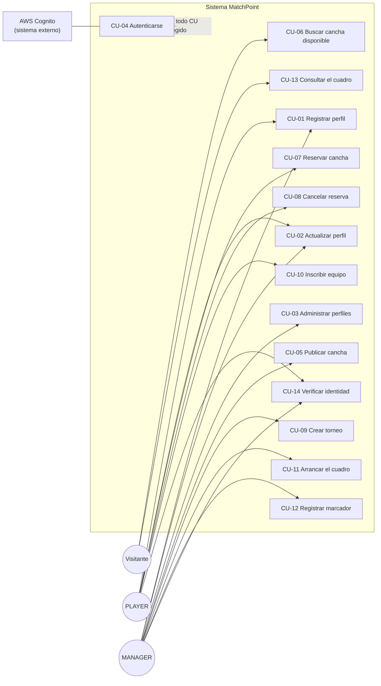
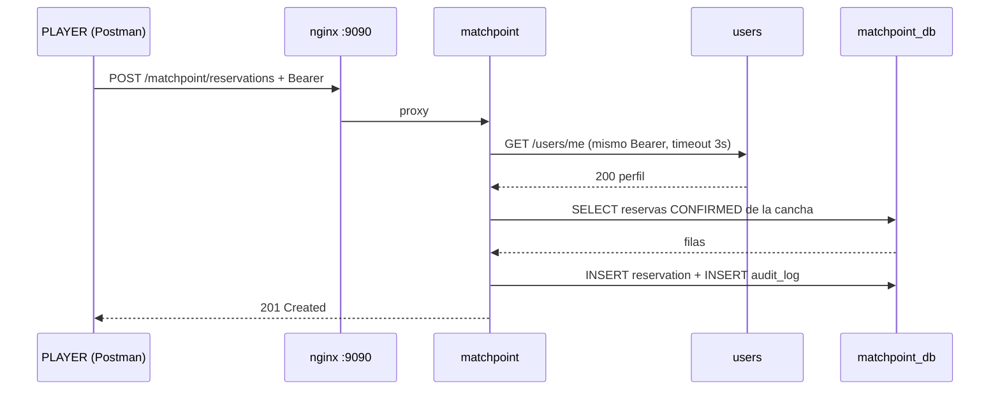

# MatchPoint · Casos de uso

**Criterio 1.1 de la rúbrica** — tabla de casos de uso.

Cada caso de uso está descrito con actor, precondiciones, flujo principal, flujos alternativos y
postcondición, y enlaza con los requerimientos de [`REQUERIMIENTOS.md`](REQUERIMIENTOS.md).
Los flujos alternativos **no son hipotéticos**: son las excepciones que el código lanza y que se
pueden disparar en vivo con los datos sembrados.

---

## 1. Diagrama de casos de uso

---

## 2. Tabla resumen

| CU | Nombre | Actor principal | RF que realiza | Endpoint | Prioridad |
|---|---|---|---|---|---|
| **CU-01** | Registrar perfil de usuario | PLAYER, MANAGER | RF-01, RF-02 | `POST /users/me` | Must |
| **CU-02** | Actualizar datos de contacto | PLAYER, MANAGER | RF-03 | `PUT /users/me` | Must |
| **CU-03** | Administrar perfiles | MANAGER | RF-04, RF-05, RF-06 | `GET /users`, `DELETE /users/{id}` | Should |
| **CU-04** | Autenticarse y obtener autorización | Todos | RF-08, RF-09, RF-10 | *(transversal)* | Must |
| **CU-05** | Publicar y mantener una cancha | MANAGER | RF-11, RF-15 | `POST` / `PATCH /matchpoint/courts` | Must |
| **CU-06** | Buscar cancha disponible | Visitante | RF-12, RF-13, RF-14 | `GET /matchpoint/courts/available` | Must |
| **CU-07** | Reservar una cancha | PLAYER | RF-16, RF-17 | `POST /matchpoint/reservations` | Must |
| **CU-08** | Consultar y cancelar reservas propias | PLAYER | RF-18, RF-19, RF-20 | `GET`/`DELETE /matchpoint/reservations` | Must |
| **CU-09** | Crear un torneo | MANAGER | RF-21 | `POST /matchpoint/tournaments` | Must |
| **CU-10** | Inscribir y retirar un equipo | PLAYER | RF-23, RF-24 | `POST`/`DELETE .../teams` | Must |
| **CU-11** | Arrancar el cuadro del torneo | MANAGER | RF-26 | `POST .../tournaments/{id}/start` | Must |
| **CU-12** | Programar y puntuar un partido | MANAGER | RF-27, RF-28, RF-29, RF-30 | `PATCH /matchpoint/matches/{id}/score` | Must |
| **CU-13** | Consultar el cuadro y el campeón | Visitante | RF-22, RF-25 | `GET /matchpoint/tournaments/{id}` | Must |
| **CU-14** | Verificar identidad efectiva | PLAYER, MANAGER | RF-31 | `GET /matchpoint/me` | Should |

---

## 3. Casos de uso detallados

### CU-01 · Registrar perfil de usuario

| | |
|---|---|
| **Actor principal** | PLAYER o MANAGER autenticado |
| **Actores secundarios** | AWS Cognito (emisor del token) |
| **Requerimientos** | RF-01, RF-02 |
| **Precondiciones** | El usuario existe y está `CONFIRMED` en el User Pool y posee un `access_token` vigente. |
| **Disparador** | Primera vez que el usuario entra a MatchPoint. |

**Flujo principal**

1. El usuario envía `POST /users/me` con nombre, correo y teléfono.
2. El sistema valida el JWT contra el JWKS de Cognito.
3. El sistema extrae `sub` y `username` **del token**, no del body.
4. Verifica que no exista ya un perfil con ese `cognito_id`.
5. Valida que el nombre no esté en blanco.
6. Guarda el perfil, registra la fila de auditoría (`INSERT`) y emite `event=user.created` con el correo enmascarado.
7. Responde `201` con el perfil creado.

**Flujos alternativos**

| # | Condición | Respuesta del sistema |
|---|---|---|
| 1a | Sin token, token expirado o manipulado | `401`, `event=auth.rejected` |
| 4a | Ya existe perfil para ese `sub` | `409` "Profile already exists for this Cognito user" |
| 5a | Nombre en blanco | `400` "Name cannot be blank" |

**Postcondición** — El usuario tiene exactamente un perfil y ya puede reservar canchas (ver CU-07).

---

### CU-02 · Actualizar datos de contacto

| | |
|---|---|
| **Actor principal** | PLAYER o MANAGER |
| **Requerimientos** | RF-03 |
| **Precondiciones** | El usuario ya ejecutó CU-01. |

**Flujo principal**

1. El usuario envía `PUT /users/me` con los datos nuevos.
2. El sistema resuelve el perfil **por el `sub` del token** — nunca por un id enviado por el cliente.
3. Valida el nombre, aplica los cambios, guarda los valores anteriores y nuevos en `audit_log`.
4. Responde `200` con el perfil actualizado.

**Flujos alternativos**

| # | Condición | Respuesta |
|---|---|---|
| 2a | El usuario nunca se registró | `404` "There is no profile for this Cognito user" |
| 3a | Nombre en blanco | `400` |

**Postcondición** — El perfil queda actualizado y la modificación es rastreable en `audit_log`
(con correo y teléfono enmascarados).

> **Nota de diseño:** no existe endpoint para que un usuario edite el perfil de otro. La
> imposibilidad es estructural, no una validación que se pueda olvidar.

---

### CU-03 · Administrar perfiles

| | |
|---|---|
| **Actor principal** | MANAGER |
| **Requerimientos** | RF-04, RF-05, RF-06 |
| **Precondiciones** | El token trae el grupo `MANAGER`. |

**Flujo principal**

1. El MANAGER solicita `GET /users` y recibe todos los perfiles.
2. Opcionalmente consulta uno con `GET /users/{id}`.
3. Da de baja un perfil con `DELETE /users/{id}`.
4. El sistema elimina la fila, deja el registro `DELETE` en `audit_log` con los valores previos y responde `204`.

**Flujos alternativos**

| # | Condición | Respuesta |
|---|---|---|
| 1a | El token es de un PLAYER | `403`, `event=authz.denied` |
| 3a | El id no existe | `404` |

**Postcondición** — El perfil desaparece de `users`, pero **su rastro sobrevive** en `audit_log`
(por eso esa tabla no tiene FK hacia `users`).

---

### CU-04 · Autenticarse y obtener autorización *(caso de uso transversal, «include» de todos los demás)*

| | |
|---|---|
| **Actor principal** | Cualquier usuario |
| **Actores secundarios** | AWS Cognito |
| **Requerimientos** | RF-08, RF-09, RF-10 |

**Flujo principal**

1. El cliente llama a Cognito (`InitiateAuth` con `PREFERRED_CHALLENGE: PASSWORD`, firmado con `SECRET_HASH`).
2. Responde el reto con `RespondToAuthChallenge` y recibe el `access_token`.
3. Envía la petición al gateway con `Authorization: Bearer <token>`.
4. El microservicio, como *Resource Server*, descarga el JWKS del User Pool y valida **firma, emisor y expiración**.
5. `CognitoGroupsConverter` traduce el claim `cognito:groups` a autoridades (`MANAGER` → `ROLE_MANAGER`).
6. La `SecurityFilterChain` decide si el rol admite ese endpoint (**primera capa de 403**).
7. Ya dentro, el *service* verifica que el recurso pertenezca al usuario (**segunda capa de 403**).

**Flujos alternativos**

| # | Condición | Respuesta | Quién la emite |
|---|---|---|---|
| 4a | Token ausente, expirado o manipulado | `401` | `LoggingAuthenticationEntryPoint` |
| 6a | Rol equivocado para el endpoint | `403` | Spring Security · `LoggingAccessDeniedHandler` |
| 7a | Rol correcto pero recurso ajeno | `403` | el *service* (`NotYourCourtException`, `NotYourReservationException`, `NotYourTournamentException`) |

**Postcondición** — La petición continúa con una identidad verificada, cuyo `sub` queda en el MDC
y aparece en **todas** las líneas de log de esa petición.

---

### CU-05 · Publicar y mantener una cancha

| | |
|---|---|
| **Actor principal** | MANAGER |
| **Requerimientos** | RF-11, RF-15 |

**Flujo principal**

1. El MANAGER envía `POST /matchpoint/courts` con nombre, sector, tipo de piso, parqueo y precio por hora.
2. El sistema valida que nombre, sector y piso no estén en blanco y que el precio sea `> 0`.
3. Asigna `managerUser` **desde el claim `username` del token**.
4. Guarda, audita (`INSERT`) y responde `201`.
5. Más adelante, el MANAGER ajusta precio o disponibilidad con `PATCH /matchpoint/courts/{id}`.

**Flujos alternativos**

| # | Condición | Respuesta |
|---|---|---|
| 1a | El token es de un PLAYER | `403` (por rol) |
| 2a | Campo obligatorio en blanco o precio `<= 0` | `400` |
| 5a | La cancha es de otro MANAGER | `403` (por propiedad) — probar con la cancha 4 de `manager_ana` |
| 5b | La cancha no existe | `404` |

**Postcondición** — La cancha aparece en el catálogo público (CU-06). Si se marca `active: false`,
deja de ser reservable de inmediato.

---

### CU-06 · Buscar cancha disponible

| | |
|---|---|
| **Actor principal** | Visitante *(no requiere token)* |
| **Requerimientos** | RF-12, RF-13, RF-14 |

**Flujo principal**

1. El visitante consulta `GET /matchpoint/courts/available?sector=Norte&sport=BASKET&startsAt=2026-08-20T18:00:00&durationMinutes=90`.
2. El sistema toma **solo las canchas activas** y aplica los filtros de sector y deporte.
3. Calcula `endsAt = startsAt + durationMinutes` y descarta toda cancha que tenga una reserva
   `CONFIRMED` solapada, evaluando `startsAt < reserva.endsAt && reserva.startsAt < endsAt`.
4. Responde `200` con la lista de canchas libres.

**Flujos alternativos**

| # | Condición | Comportamiento |
|---|---|---|
| 1a | No se envía franja horaria | Devuelve todas las canchas activas que cumplen los filtros, sin evaluar solapamiento |
| 1b | `durationMinutes <= 0` | Se ignora la franja y se aplica el mismo criterio que en 1a |
| 4a | Ninguna cancha libre | `200` con lista vacía — no es un error |

**Postcondición** — Ninguna. Es una consulta pura, sin token y sin efectos secundarios: es lo
primero que ve un usuario nuevo del producto.

---

### CU-07 · Reservar una cancha

**El caso de uso más completo del sistema: es el único que atraviesa los dos microservicios.**

| | |
|---|---|
| **Actor principal** | PLAYER |
| **Actores secundarios** | Microservicio `users` |
| **Requerimientos** | RF-16, RF-17 |
| **Precondiciones** | El jugador ejecutó CU-01 y eligió una cancha con CU-06. |

**Flujo principal**

1. El PLAYER envía `POST /matchpoint/reservations` con `courtId`, `startsAt` y `durationMinutes`.
2. `matchpoint` llama a `users` (`GET /users/me`) **propagando la cabecera `Authorization` del usuario**, con *timeout* de 3 s.
3. `users` responde con el perfil.
4. `matchpoint` verifica que la cancha exista y esté activa.
5. Verifica que la duración sea `> 0`.
6. Verifica que no exista ninguna reserva `CONFIRMED` solapada en esa cancha.
7. Guarda la reserva con `ownerUser` del token y **copia** en `ownerName` el nombre que devolvió `users`.
8. Audita (`INSERT`), emite `event=reservation.created` y responde `201`.

**Flujos alternativos**

| # | Condición | Respuesta | Regla |
|---|---|---|---|
| 1a | El token es de un MANAGER | `403` | RN-12 |
| 2a | `users` no responde en 3 s o está caído | `503` "users unavailable" | RN-14 |
| 3a | El jugador no tiene perfil registrado | `409` | RN-03 |
| 4a | La cancha no existe | `404` | — |
| 4b | La cancha está inactiva *(cancha 3 sembrada)* | `409` | RN-02 |
| 5a | `durationMinutes <= 0` | `400` | — |
| 6a | La franja se solapa con otra reserva *(reserva 1 sembrada)* | `409` | RN-01 |

**Postcondición** — Existe una reserva `CONFIRMED`, la franja queda bloqueada para CU-06 y hay
rastro en `audit_log`. `ownerName` guarda una **copia deliberada** del nombre: si `users` cae
después, la reserva ya creada se sigue leyendo.

---

### CU-08 · Consultar y cancelar reservas propias

| | |
|---|---|
| **Actor principal** | PLAYER |
| **Requerimientos** | RF-18, RF-19, RF-20 |

**Flujo principal**

1. El PLAYER consulta `GET /matchpoint/reservations/me` y recibe **solo las suyas**, ordenadas por fecha de inicio descendente.
2. Abre una con `GET /matchpoint/reservations/{id}`.
3. La cancela con `DELETE /matchpoint/reservations/{id}`.
4. El sistema cambia el estado a `CANCELLED` (**no borra la fila**), audita el `UPDATE` con el estado anterior y responde `204`.

**Flujos alternativos**

| # | Condición | Respuesta |
|---|---|---|
| 2a | La reserva es de otro jugador *(reserva 4 de `player_luis`)* | `403` (por propiedad) |
| 2b | La reserva no existe | `404` |
| 3a | El token es de un MANAGER | `403` (por rol) |

**Postcondición** — La reserva queda `CANCELLED` y **la franja vuelve a estar disponible**: la
consulta de solapamiento solo mira reservas `CONFIRMED`. El borrado lógico conserva el histórico
para auditoría.

---

### CU-09 · Crear un torneo

| | |
|---|---|
| **Actor principal** | MANAGER |
| **Requerimientos** | RF-21 |

**Flujo principal**

1. El MANAGER envía `POST /matchpoint/tournaments` con nombre, `maxTeams`, premio opcional y sede opcional.
2. El sistema valida que el nombre no esté en blanco.
3. Valida que `maxTeams` sea **potencia de dos entre 2 y 32**.
4. Si se indicó sede, verifica que la cancha exista y **sea del mismo MANAGER**.
5. Crea el torneo en estado `REGISTRATION`, audita y responde `201`.

**Flujos alternativos**

| # | Condición | Respuesta | Motivo |
|---|---|---|---|
| 1a | El token es de un PLAYER | `403` | por rol |
| 2a | Nombre en blanco | `400` | — |
| 3a | `maxTeams` = 6, 0, 64… | `400` con el mensaje que enumera los valores válidos | sin potencia de dos habría *byes* |
| 4a | La cancha no existe | `404` | — |
| 4b | La cancha es de otro MANAGER | `403` | no se secuestra la sede ajena |

**Postcondición** — El torneo acepta inscripciones (CU-10) y ya es visible públicamente (CU-13).

---

### CU-10 · Inscribir y retirar un equipo

| | |
|---|---|
| **Actor principal** | PLAYER |
| **Requerimientos** | RF-23, RF-24 |
| **Precondiciones** | El torneo existe y está en `REGISTRATION`. |

**Flujo principal**

1. El PLAYER envía `POST /matchpoint/tournaments/{id}/teams` con nombre del equipo y datos de contacto.
2. El sistema verifica que el torneo esté en `REGISTRATION`.
3. Verifica que los cuatro campos de contacto no estén en blanco.
4. Verifica que quede cupo (`equipos inscritos < maxTeams`).
5. Verifica que el nombre no esté repetido en ese torneo.
6. Guarda el equipo con `registeredByUser` del token, audita con el correo enmascarado y responde `201`.
7. Antes de que arranque el torneo, el mismo jugador puede retirarlo con `DELETE .../teams/{teamId}`.

**Flujos alternativos**

| # | Condición | Respuesta | Regla |
|---|---|---|---|
| 1a | El token es de un MANAGER | `403` | RN-12 |
| 2a | El torneo ya arrancó o terminó *(torneo 3 `FINISHED`)* | `409` | RN-07 |
| 3a | Algún dato de contacto en blanco | `400` | — |
| 4a | Cupo lleno | `409` | — |
| 5a | Nombre de equipo duplicado | `409` | RN-06 |
| 7a | El equipo lo inscribió otro jugador | `403` | por propiedad |
| 7b | El torneo ya arrancó | `409` | RN-07 |

**Postcondición** — El equipo cuenta para el cupo y aparece en el listado público. Cuando el
conteo alcanza `maxTeams`, el torneo puede arrancar (CU-11).

---

### CU-11 · Arrancar el cuadro del torneo

| | |
|---|---|
| **Actor principal** | MANAGER dueño del torneo |
| **Requerimientos** | RF-26 |
| **Precondiciones** | El torneo está en `REGISTRATION` con **exactamente** `maxTeams` equipos. |

**Flujo principal**

1. El MANAGER envía `POST /matchpoint/tournaments/{id}/start`.
2. El sistema verifica la propiedad del torneo y el estado `REGISTRATION`.
3. Verifica que los equipos inscritos sean exactamente `maxTeams`.
4. Ordena los equipos por id (orden de inscripción) y arma la **primera ronda**: parejas
   consecutivas, estado `READY`, `currentRound = 1`.
5. Crea **todas las rondas siguientes** como slots vacíos en estado `PENDING`
   (`maxTeams / 2^ronda` partidos por ronda).
6. Cambia el estado del torneo a `IN_PROGRESS`, audita y devuelve el cuadro completo con los
   nombres de ronda (*Quarterfinals*, *Semifinals*, *Final*).

**Flujos alternativos**

| # | Condición | Respuesta | Dato sembrado que lo dispara |
|---|---|---|---|
| 1a | El token es de un PLAYER | `403` | — |
| 2a | El torneo es de otro MANAGER | `403` | torneo 4 de `manager_ana` |
| 2b | El torneo ya está `IN_PROGRESS` o `FINISHED` | `409` | torneo 3 |
| 3a | Faltan o sobran equipos | `409` con el conteo exacto en el mensaje | torneo 1 con 3 de 4 equipos |

**Postcondición** — Existe el cuadro completo. Las inscripciones y los retiros quedan cerrados;
solo los partidos `READY` admiten marcador.

> **Decisión de diseño:** el cuadro entero se crea de una sola vez, no ronda por ronda. Así la
> estructura del torneo es visible desde el minuto uno y el avance del ganador es una simple
> actualización del slot padre (`ronda+1`, `posición/2`), no una creación condicional.

---

### CU-12 · Programar y puntuar un partido

| | |
|---|---|
| **Actor principal** | MANAGER dueño del torneo |
| **Requerimientos** | RF-27, RF-28, RF-29, RF-30 |

**Flujo principal**

1. El MANAGER fija fecha y hora con `PATCH /matchpoint/matches/{matchId}/schedule`.
2. Jugado el partido, envía `PATCH /matchpoint/matches/{matchId}/score` con `homeScore` y `awayScore`.
3. El sistema verifica propiedad, que el partido esté `READY`, que los marcadores no sean negativos y que **no haya empate**.
4. Actualiza las estadísticas de ambos equipos: partidos jugados, ganados, perdidos, puntos a favor y en contra.
5. Marca al perdedor como `eliminated` y fija `winnerTeam`; el partido pasa a `PLAYED`.
6. **Si no era la última ronda:** coloca al ganador en el slot padre (`ronda+1`, `posición/2`) —
   como local si la posición era par, como visitante si era impar — y, si el slot padre ya tiene
   sus dos equipos, lo pasa a `READY`.
7. **Si era la última ronda:** fija `championTeam` y el torneo pasa a `FINISHED`.
8. Audita el `UPDATE` y responde `200` con el partido.

**Flujos alternativos**

| # | Condición | Respuesta | Regla |
|---|---|---|---|
| 2a | El torneo es de otro MANAGER | `403` | RN-11 |
| 3a | El partido está `PENDING` (aún sin los dos equipos) | `409` | RN-10 |
| 3b | El partido ya está `PLAYED` | `409` | RN-09 |
| 3c | Algún marcador es negativo | `400` | — |
| 3d | `homeScore == awayScore` | `400` "Ties are not allowed…" | RN-08 |
| 1a | Se intenta reprogramar un partido ya jugado | `409` | — |

**Postcondición** — El cuadro avanza solo. Al puntuar el partido de la última ronda el torneo
queda cerrado con campeón, y CU-13 lo muestra sin ninguna acción adicional.

---

### CU-13 · Consultar el cuadro y el campeón

| | |
|---|---|
| **Actor principal** | Visitante *(no requiere token)* |
| **Requerimientos** | RF-22, RF-25 |

**Flujo principal**

1. El visitante consulta `GET /matchpoint/tournaments` y ve los torneos con su conteo de equipos.
2. Abre uno con `GET /matchpoint/tournaments/{id}`.
3. El sistema devuelve el progreso: estado, equipos inscritos, **rondas agrupadas y ordenadas**
   con nombre legible, cada partido con sus equipos y marcador, y el campeón si el torneo terminó.

**Flujos alternativos**

| # | Condición | Respuesta |
|---|---|---|
| 2a | El torneo no existe | `404` |
| 3a | El torneo aún está en `REGISTRATION` | `200` con lista de rondas vacía — todavía no hay cuadro |

**Postcondición** — Ninguna. Es la vista pública que hace del torneo algo compartible sin pedir
cuenta a nadie.

---

### CU-14 · Verificar identidad efectiva

| | |
|---|---|
| **Actor principal** | PLAYER o MANAGER |
| **Requerimientos** | RF-31 |

**Flujo principal**

1. El usuario consulta `GET /matchpoint/me`.
2. `matchpoint` devuelve lo que dice el token (`username`, `sub`, `groups`) **y** llama a `users`
   para adjuntar el perfil almacenado.
3. Responde `200` con ambas partes.

**Flujos alternativos**

| # | Condición | Respuesta |
|---|---|---|
| 1a | Sin token o token manipulado | `401` |
| 2a | El usuario no tiene perfil en `users` | `200` con la parte del token y el perfil vacío |
| 2b | `users` no responde | `503` |

**Postcondición** — Ninguna. Su valor es diagnóstico: en una sola llamada demuestra que el token
cruza nginx, que el rol se resolvió bien y que el salto entre microservicios funciona.

---

## 4. Matriz caso de uso × código HTTP

Sirve como guion de la demo: cada celda marcada es un `pm.test` de la colección de Postman.

| CU | 200/201/204 | 400 | 401 | 403 rol | 403 propiedad | 404 | 409 | 503 |
|---|:--:|:--:|:--:|:--:|:--:|:--:|:--:|:--:|
| CU-01 Registrar perfil | ✔ | ✔ | ✔ | | | | ✔ | |
| CU-02 Actualizar perfil | ✔ | ✔ | ✔ | | | ✔ | | |
| CU-03 Administrar perfiles | ✔ | | ✔ | ✔ | | ✔ | | |
| CU-05 Publicar cancha | ✔ | ✔ | ✔ | ✔ | ✔ | ✔ | | |
| CU-06 Buscar disponibilidad | ✔ | | | | | | | |
| CU-07 Reservar | ✔ | ✔ | ✔ | ✔ | | ✔ | ✔ | ✔ |
| CU-08 Cancelar reserva | ✔ | | ✔ | ✔ | ✔ | ✔ | | |
| CU-09 Crear torneo | ✔ | ✔ | ✔ | ✔ | ✔ | ✔ | | |
| CU-10 Inscribir equipo | ✔ | ✔ | ✔ | ✔ | ✔ | ✔ | ✔ | |
| CU-11 Arrancar cuadro | ✔ | | ✔ | ✔ | ✔ | ✔ | ✔ | |
| CU-12 Puntuar partido | ✔ | ✔ | ✔ | ✔ | ✔ | ✔ | ✔ | |
| CU-13 Consultar cuadro | ✔ | | | | | ✔ | | |
| CU-14 Verificar identidad | ✔ | | ✔ | | | | | ✔ |

Las columnas de error no son decorativas: **cada una está cubierta por al menos una prueba
automática** en `src/test` y por un request de la colección de Postman.
