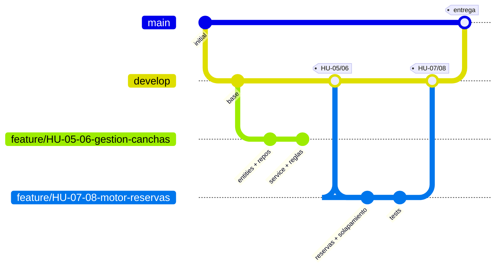

# MatchPoint · Manejo de GitFlow por el equipo

**Criterio 1.2 de la rúbrica** — manejo apropiado por el equipo de GitFlow.

Este documento describe **el flujo que realmente usó el equipo**, no el diagrama teórico de
Vincent Driessen. Todo lo que se afirma aquí se comprueba con los comandos de la sección 7.

---

## 1. El equipo y el reparto

| Integrante | Usuario git | Responsabilidad |
|---|---|---|
| Josué Herrera | `jxherrera` | Microservicio `matchpoint` (canchas, reservas, torneos, partidos), gateway, logging, auditoría, pruebas |
| Fernando Socasi | `Nandox3s` | Microservicio `users`, seguridad y autenticación con Cognito, pruebas |

El reparto no es casual: **coincide con la frontera de los microservicios**, así que dos personas
pueden trabajar en paralelo sin tocar los mismos archivos. Los conflictos de merge quedaron
limitados a `docker-compose.yml` y al `README.md`, que son los dos puntos de encuentro.

---

## 2. Ramas permanentes

| Rama | Rol | Quién escribe en ella | Estado |
|---|---|---|---|
| `main` | **Producción.** Solo recibe versiones que ya se demostraron funcionando de punta a punta. Cada llegada a `main` equivale a una entrega. | Nadie directamente: solo por merge desde `develop` | Estable |
| `develop` | **Integración.** Es donde conviven todas las historias terminadas. Es la rama por defecto del repositorio y la base de toda rama `feature/*`. | Nadie directamente: solo por merge desde `feature/*` | Rama activa |

**Regla que el equipo respetó sin excepción:** ningún commit de funcionalidad se hizo sobre
`main` ni sobre `develop`. Toda línea de código entró por una rama `feature/*`.

---

## 3. Ramas temporales: `feature/*`

Una rama por historia de usuario (o por par de historias cuando comparten el mismo módulo y
separarlas habría producido dos ramas que se pisan).

| Rama | Historias | Requerimientos | Responsable |
|---|---|---|---|
| `feature/HU-01-registro-perfil` | HU-01 | RF-01, RF-02 | Fernando |
| `feature/HU-02-actualizacion-perfil` | HU-02 | RF-03 | Fernando |
| `feature/HU-03-admin-usuarios` | HU-03 | RF-04 … RF-07 | Fernando |
| `feature/HU-04-autenticacion-cognito` | HU-04 | RF-08, RF-09, RF-10 | Fernando |
| `feature/HU-05-06-gestion-canchas` | HU-05, HU-06 | RF-11 … RF-15 | Josué |
| `feature/HU-07-08-motor-reservas` | HU-07, HU-08 | RF-16 … RF-20 | Josué |
| `feature/HU-09-10-inscripcion-torneos` | HU-09, HU-10 | RF-21 … RF-25 | Josué |
| `feature/HU-11-12-cuadro-partidos` | HU-11, HU-12 | RF-26 … RF-30 | Josué |
| `feature/configuracion-y-documentacion` | Transversal | RF-31 … RF-33, RNF-01 … RNF-16 | Ambos |

**Las nueve ramas siguen publicadas en `origin`**, junto a `main` y `develop` — once referencias en
total. No se borraron a propósito: son la evidencia del flujo y permiten al evaluador abrir
cualquier historia y ver exactamente qué entró con ella.

```bash
git for-each-ref --format='%(refname:short) -> %(objectname:short) %(subject)' refs/remotes/origin
```

Las nueve son ancestros de `develop`, es decir **están efectivamente integradas**, no publicadas y
olvidadas. Se comprueba una por una:

```bash
for b in $(git branch -r --format='%(refname:short)' | grep feature); do
  git merge-base --is-ancestor "$b" origin/develop && echo "$b integrada"
done
```

### Convención de nombres

```
feature/HU-<número>-<slug-en-kebab-case>
feature/HU-<n>-<m>-<slug>            cuando la rama cubre dos historias del mismo módulo
feature/<slug>                       trabajo transversal sin número de historia
```

El nombre de la rama **contiene el identificador de la historia**, así que basta `git branch -a`
para reconstruir el backlog. Es lo que permite la trazabilidad
`historia → rama → commit → requerimiento` de la sección 6 de
[`REQUERIMIENTOS.md`](REQUERIMIENTOS.md#6-trazabilidad-requerimiento--historia--rama).

---

## 4. Ciclo de vida de una historia



Los seis pasos que el equipo siguió en cada historia:

1. **Partir de `develop` actualizado.**
   ```bash
   git checkout develop && git pull origin develop
   git checkout -b feature/HU-07-08-motor-reservas
   ```
2. **Trabajar solo dentro del alcance de la historia.** Si aparecía algo fuera de alcance, se
   anotaba para otra rama; no se colaba en la que estaba abierta.
3. **Commits pequeños y descriptivos** siguiendo la convención de la sección 5.
4. **Pruebas verdes antes de pedir la integración**, incluido el umbral de cobertura:
   ```bash
   cd matchpoint && ./gradlew check
   ```
5. **Reintegrar `develop` en la rama antes de mezclar**, para que el conflicto —si lo hay— se
   resuelva en la rama de quien lo provocó y nunca en `develop`:
   ```bash
   git fetch origin && git rebase origin/develop
   ```
6. **Mezclar a `develop` y publicar.** La rama se queda publicada como evidencia.
   ```bash
   git checkout develop && git merge feature/HU-07-08-motor-reservas
   git push origin develop
   ```

### Por qué el historial es lineal

`git log --graph` muestra una línea recta y no el clásico grafo con burbujas. Es **deliberado**:
antes de cada integración se hizo `rebase` sobre `develop`, así que el merge resultó
*fast-forward*. La ventaja es un historial legible en el que cada commit es una unidad de trabajo
completa y `git bisect` funciona sin ruido; el costo es que el grafo no dibuja la burbuja de la
rama, y por eso **las ramas siguen publicadas**: son ellas las que prueban la separación del
trabajo, no la forma del grafo.

### Por qué HU-01 a HU-04 aparecen dos veces

Es lo primero que salta al leer el historial, así que conviene explicarlo antes de que lo pregunten.

Los dos integrantes empezaron a trabajar en **repositorios separados**: Fernando el microservicio
`users` con la seguridad, Josué el microservicio `matchpoint` con todo el dominio deportivo. Al
unirlos, el commit `d32f9bb` (`chore(repo): mover contenido de match a la raíz del repositorio`)
reorganizó el árbol, y las cuatro historias de `users` se **re-aplicaron sobre la estructura nueva**:

| Historia | Commit original | Re-aplicado tras la reestructuración |
|---|---|---|
| HU-04 Autenticación con Cognito | `92e4e56` | `351e254` |
| HU-01 Registro de perfil | `5c73958` | `9284301` |
| HU-02 Actualización de perfil | `1e1218a` | `8488316` |
| HU-03 Administración de perfiles | `586164c` | `c614302` |

**No es trabajo repetido: es el mismo trabajo reubicado.** El contenido de los commits es
equivalente; lo que cambia son las rutas de los archivos. La alternativa —reescribir el historial
con `filter-branch` para que la duplicación desapareciera— habría borrado la evidencia de que las
cuatro historias existieron antes de la unificación, que es justamente lo que la rúbrica pide poder
verificar.

Lo que sí demuestra la duplicación, y vale la pena decirlo: **el orden de prioridad se respetó las
dos veces**. HU-04 va primera en la serie original (`92e4e56`, el primer commit de funcionalidad del
repositorio) y también en la re-aplicada (`351e254`, antes que HU-01, HU-02 y HU-03). No fue
casualidad: fue la regla de [ADR-001](adr/ADR-001-identidad-primero.md).

---

## 5. Convención de commits

Conventional Commits **con el identificador de la historia dentro del asunto**:

```
<tipo>(<ámbito>): HU-<nn> <qué hace el commit, en imperativo>
```

Ejemplos reales del historial:

```
feat(security):     HU-04 implementar validación de JWT y JWKS con AWS Cognito
feat(users):        HU-01 crear endpoints para registro automático y visualización de perfil
feat(users):        HU-02 implementar actualización de datos de contacto del jugador
feat(users):        HU-03 añadir listado y borrado de perfiles exclusivo para rol MANAGER
feat(courts):       HU-05 HU-06 implementar CRUD de canchas y motor de búsqueda de disponibilidad
feat(reservations): HU-07 HU-08 desarrollar creación de reservas con validación de solapamiento y usuarios
feat(tournaments):  HU-09 HU-10 habilitar creación de torneos e inscripción de equipos
feat(matches):      HU-11 HU-12 generar llaves automáticas y lógica de avance por puntuación
chore:              integrar arquitectura base docker-compose, documentación y colección de Postman
chore(repo):        mover contenido de match a la raíz del repositorio
```

| Tipo | Cuándo | Ámbitos usados |
|---|---|---|
| `feat` | Funcionalidad nueva visible para el usuario | `users`, `security`, `courts`, `reservations`, `tournaments`, `matches` |
| `chore` | Infraestructura, configuración, documentación, movimientos de archivos | `repo`, sin ámbito |
| `fix` | Corrección de un comportamiento ya entregado | el del módulo corregido |
| `test` | Pruebas añadidas sin cambio de comportamiento | el del módulo |

Consecuencia práctica: `git log --oneline --grep="HU-07"` devuelve todo lo que entró con esa
historia, sin abrir ninguna herramienta externa.

---

## 6. Reglas de convivencia que el equipo acordó

1. **`main` y `develop` son de solo lectura para las personas.** Se escriben por merge.
2. **Una historia, una rama.** Si una historia crecía demasiado, se partía en dos ramas antes de
   empezar, nunca a mitad de camino.
3. **Nada se mezcla en rojo.** `./gradlew check` debe pasar —incluido el umbral de cobertura del
   100 %— antes de integrar.
4. **El conflicto se resuelve en la rama de quien lo provocó**, con `rebase` sobre `develop`.
5. **Ningún secreto entra al repositorio.** `.env`, `pgadmin/pgpass` y el *client secret* de
   Cognito están en `.gitignore`; se versionan solo las plantillas `.example`.
6. **Las ramas de historia no se borran** hasta después de la calificación.

---

## 7. Cómo verificar todo esto en 30 segundos

Comandos para ejecutar delante del evaluador:

```bash
git branch -a
```
Muestra las dos ramas permanentes y las nueve `feature/*` publicadas.

```bash
git log --oneline --graph --all
```
Muestra un commit por historia, con su identificador `HU-nn` en el asunto.

```bash
git log --oneline --grep="HU-07"
```
Aísla todo lo que entró con una historia concreta.

```bash
git log --all --format='%h | %an | %s' | sort -t'|' -k2
```
Muestra el reparto de commits por autor. **Ver la nota de la sección 8 sobre la identidad de git.**

```bash
git log --oneline origin/main..origin/develop
```
Muestra qué hay integrado en `develop` que todavía no llegó a `main`.

```bash
git show --stat f1cf571
```
Muestra exactamente qué archivos tocó una historia — la prueba de que el alcance se respetó. Se usa
`git show` y no `git diff` contra la rama porque, al ser integraciones *fast-forward*, la rama
`feature/*` y `develop` apuntan al mismo objeto y el `diff` entre ellas sale vacío.

---

## 8. Autocrítica

Lo que el equipo haría distinto con más tiempo, y que conviene decir antes de que lo pregunten:

- **La identidad de git no estaba configurada en una de las máquinas.** Cinco commits —`d32f9bb`,
  `351e254`, `9284301`, `8488316`, `c614302`— quedaron registrados con el autor por defecto
  `Your Name <your-email@example.com>`, y el `initial import` con `GitHub Copilot <you@example.com>`.
  El trabajo es de Fernando Socasi (los cuatro de `users`) y del equipo (el movimiento del
  repositorio), pero **el historial no lo puede demostrar por sí solo**: hay que leerlo junto con
  esta tabla.

  | Commit | Autor registrado | Autor real |
  |---|---|---|
  | `67af96f` `chore(repo): initial import` | `GitHub Copilot` | Fernando Socasi |
  | `d32f9bb` `chore(repo): mover contenido…` | `Your Name` | Josué Herrera |
  | `351e254` `feat(security): HU-04` | `Your Name` | Fernando Socasi |
  | `9284301` `feat(users): HU-01` | `Your Name` | Fernando Socasi |
  | `8488316` `feat(users): HU-02` | `Your Name` | Fernando Socasi |
  | `c614302` `feat(users): HU-03` | `Your Name` | Fernando Socasi |

  La atribución sí es correcta en los commits originales de esas mismas historias (`92e4e56`,
  `5c73958`, `1e1218a`, `586164c`, todos con autor `Nandox3s`), que siguen en el historial. Corregir
  los cinco exigiría reescribir historia ya publicada y compartida, lo que rompería los hashes que
  cita toda esta documentación; se prefirió **declararlo** antes que reescribirlo. Lo primero que
  haría el equipo en un proyecto nuevo es fijar la identidad antes del primer commit:
  ```bash
  git config user.name "Nombre Apellido" && git config user.email "correo@puce.edu.ec"
  ```

- **Pull requests con revisión cruzada.** Las integraciones se hicieron por merge local. Con PR en
  GitHub quedaría registrada la revisión del otro integrante, que es la parte de GitFlow que más
  valor aporta en un equipo grande.
- **Ramas `release/*` y `hotfix/*`.** El modelo completo las contempla; en un proyecto de dos
  personas y una sola entrega no aportaban nada, así que se omitieron a conciencia. Se
  documentan aquí para dejar claro que la omisión fue una decisión, no un olvido.
- **Integración continua.** Un workflow de GitHub Actions que ejecute `./gradlew check` en cada
  push convertiría la regla 3 de la sección 6 en algo que el repositorio hace cumplir por sí solo,
  en lugar de depender de la disciplina del equipo.
