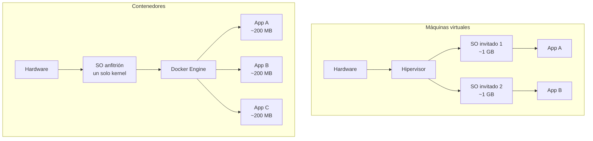
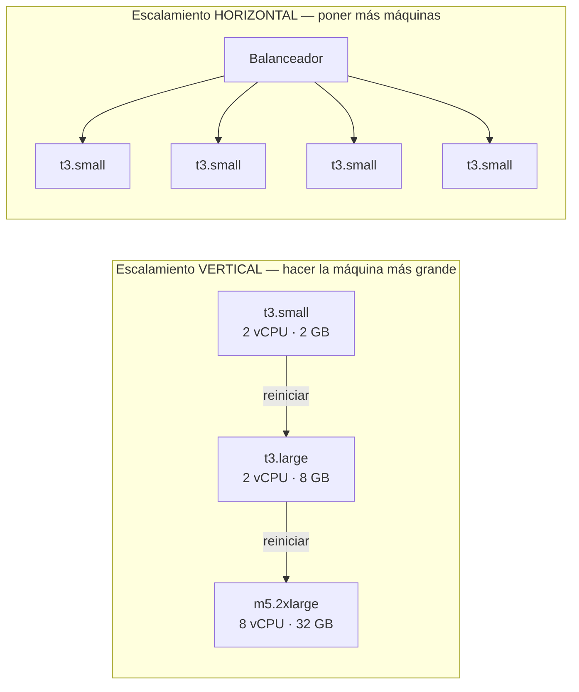
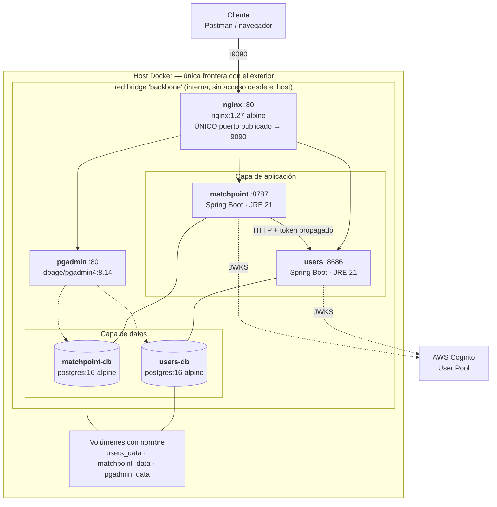
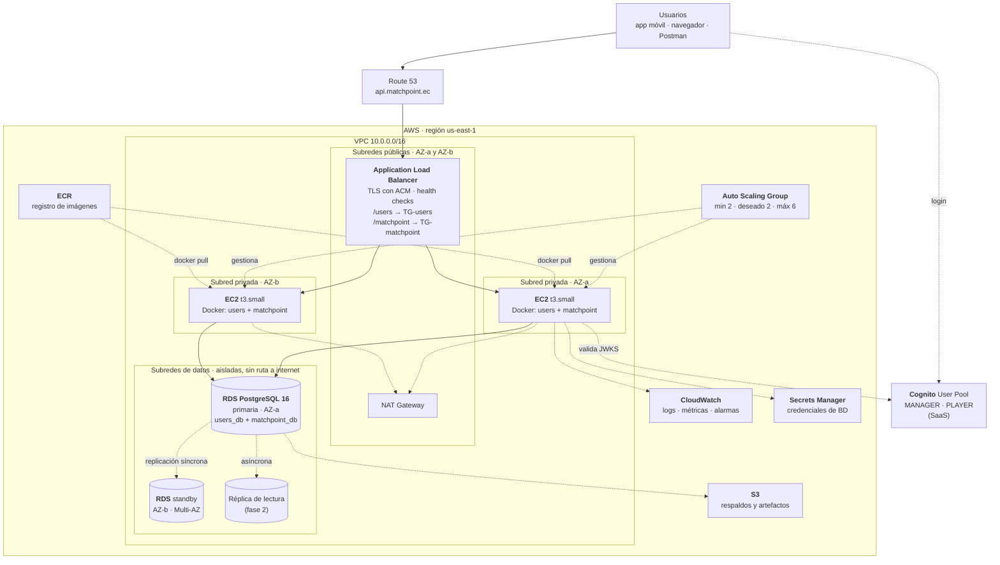

# MatchPoint · Computación en la nube

**Criterio 4 de la rúbrica (/8).**

| Sub-criterio | Puntos | Sección |
|---|:--:|---|
| 4.1 Conceptos de computación en la nube · ventajas y desventajas del escalamiento vertical y horizontal | /2 | [§1](#1-conceptos-de-computación-en-la-nube-41) y [§2](#2-escalamiento-vertical-vs-horizontal-41) |
| 4.2 Virtualización de contenedores para la gestión de sistemas multicapas y multiplataforma | /3 | [§3](#3-virtualización-de-contenedores-implementado-42) |
| 4.3 Diseño de la arquitectura de infraestructura en la nube | /3 | [§4](#4-arquitectura-de-infraestructura-en-la-nube-43) |

> **Nota de alcance, dicha de frente:** la demostración corre sobre Docker Compose local. La
> arquitectura en AWS de la sección 4 está **diseñada y dimensionada, no desplegada**. La
> justificación de esa decisión y sus consecuencias están en
> [ADR-011](../01-analisis/adr/ADR-011-despliegue-local-y-arquitectura-objetivo.md).

---

## 1. Conceptos de computación en la nube (4.1)

### 1.1 Los tres modelos de servicio, situados en este proyecto

| Modelo | Qué administra el proveedor | Qué administras tú | Dónde aparece en MatchPoint |
|---|---|---|---|
| **IaaS** | Hardware, red física, hipervisor | Sistema operativo, runtime, aplicación, datos | Las instancias **EC2** de la arquitectura objetivo: elegimos la AMI, el tamaño y qué se instala |
| **PaaS** | Todo lo anterior + sistema operativo y runtime | Aplicación y datos | **RDS** para PostgreSQL: administra motor, parches, respaldos y réplicas; nosotros solo el esquema |
| **SaaS** | Todo | Configuración y datos | **AWS Cognito**: no administramos nada del servicio de identidad, solo definimos el User Pool y los grupos |

El proyecto **usa los tres a la vez**, que es lo normal en un sistema real: el cómputo en IaaS por
control, la base en PaaS por costo operativo, la identidad en SaaS porque no queremos ser
responsables de almacenar contraseñas
([ADR-002](../01-analisis/adr/ADR-002-cognito-como-proveedor-de-identidad.md)).

### 1.2 Contenedores frente a máquinas virtuales

Es la distinción que la rúbrica pide "identificar", y la que explica por qué el proyecto está
contenedorizado:



| | Máquina virtual | Contenedor |
|---|---|---|
| **Aísla** | Hardware virtualizado completo | Procesos, mediante *namespaces* y *cgroups* |
| **Incluye** | Un sistema operativo invitado entero | Solo la aplicación y sus dependencias |
| **Arranque** | Decenas de segundos a minutos | Milisegundos a segundos |
| **Peso típico** | Gigabytes | Decenas o cientos de megabytes |
| **Aislamiento** | Más fuerte: kernels separados | Más débil: kernel compartido |
| **Densidad** | Pocas por servidor | Decenas o cientos por servidor |
| **Cuándo conviene** | Sistemas operativos distintos, cargas no confiables, cumplimiento normativo estricto | Microservicios, despliegue frecuente, escalado rápido |

**En MatchPoint son contenedores** porque los seis servicios comparten Linux, arrancan y mueren con
frecuencia, y el objetivo es que el mismo artefacto corra idéntico en la laptop de cada integrante
y en el servidor. En la arquitectura objetivo **conviven las dos cosas**: contenedores Docker
corriendo *dentro* de instancias EC2, que son máquinas virtuales. No son alternativas excluyentes,
son capas.

### 1.3 Otros conceptos que el proyecto ejercita

| Concepto | Cómo se manifiesta |
|---|---|
| **Elasticidad** | La capacidad se ajusta a la demanda. Es lo que hace posible dimensionar para el pico de sábado y no pagarlo el martes. |
| **Pago por uso** | No hay inversión inicial en hardware. El costo estimado de §4.6 es mensual y variable. |
| **Alta disponibilidad** | Redundancia entre **zonas de disponibilidad**: RDS Multi-AZ y ASG repartido en dos AZ. |
| **Estado y ausencia de estado** | Los contenedores de aplicación son *stateless*: todo el estado vive en RDS o en Cognito. **Es la precondición del escalado horizontal**, y el proyecto ya la cumple. |
| **Infraestructura como código** | `docker-compose.yml` cumple ese rol hoy; en la nube el equivalente sería Terraform o CloudFormation. |
| **Responsabilidad compartida** | AWS asegura *la* nube; nosotros aseguramos lo que ponemos *en* la nube: grupos de seguridad, roles de IAM, cifrado, secretos. |

---

## 2. Escalamiento vertical vs. horizontal (4.1)

### 2.1 Las dos estrategias



### 2.2 Escalamiento vertical (*scale up*)

**Definición:** aumentar los recursos —CPU, memoria, disco, IOPS— de una sola instancia.

| Ventajas | Desventajas |
|---|---|
| **No requiere cambios en la aplicación.** Un monolito con estado en memoria escala vertical sin tocar una línea. | **Tiene techo físico.** Existe una instancia más grande… hasta que no existe. |
| **Sin complejidad distribuida:** no hay balanceador, ni sesiones compartidas, ni consistencia entre nodos. | **Requiere reinicio.** Cambiar el tipo de instancia implica detenerla: hay ventana de indisponibilidad. |
| **Menor latencia interna:** todo ocurre en la misma máquina, sin saltos de red. | **Costo no lineal.** El doble de recursos suele costar más del doble; las instancias grandes tienen sobreprecio. |
| **Más simple de operar y de depurar:** un solo lugar donde mirar los logs. | **Sigue siendo un punto único de fallo.** Una máquina enorme que se cae deja el sistema caído. |
| **Ideal para bases de datos relacionales**, donde repartir escrituras entre nodos es un problema difícil. | **Elasticidad pobre:** no sirve para absorber un pico de dos horas, porque el cambio no es inmediato ni automático. |

**Dónde aplica en MatchPoint:** en **RDS**. Una base relacional con FK y transacciones escala
naturalmente hacia arriba. Pasar de `db.t3.micro` a `db.t3.small` es un cambio de parámetro con un
reinicio de pocos minutos, y resuelve el 90 % de los problemas de capacidad de este sistema.

### 2.3 Escalamiento horizontal (*scale out*)

**Definición:** añadir más instancias del mismo servicio y repartir la carga entre ellas.

| Ventajas | Desventajas |
|---|---|
| **Prácticamente sin techo:** siempre se puede añadir una instancia más. | **Exige que la aplicación no tenga estado.** Cualquier dato en memoria de un nodo se pierde o se desincroniza. |
| **Alta disponibilidad incluida:** si un nodo cae, el balanceador deja de enviarle tráfico y el servicio sigue. | **Requiere balanceador**, y con él configuración, *health checks* y un componente más que operar. |
| **Elasticidad real:** el Auto Scaling Group añade y quita instancias solo, según una métrica. | **Complejidad distribuida:** logs repartidos, depuración más difícil, posibles condiciones de carrera entre nodos. |
| **Costo lineal y granular:** N instancias pequeñas suelen costar menos que una grande equivalente. | **La base de datos se vuelve el cuello de botella.** Escalar la capa de aplicación no escala las escrituras. |
| **Sin indisponibilidad al escalar:** las instancias nuevas entran en caliente. | **Coordinación de despliegues:** hay que actualizar N nodos sin cortar el servicio. |

**Dónde aplica en MatchPoint:** en los **microservicios**. Los contenedores de `users` y
`matchpoint` **ya son *stateless*** — no guardan sesión (el JWT es autocontenido), no guardan
archivos y todo su estado vive en PostgreSQL. La precondición del escalado horizontal ya está
cumplida por diseño, no habría que refactorizar nada.

### 2.4 La estrategia de MatchPoint: mixta, y por capa

No es una elección entre las dos: **cada capa escala como le conviene**.

| Capa | Estrategia | Por qué | Disparador |
|---|---|---|---|
| **nginx / ALB** | Horizontal (gestionado) | El ALB escala solo; es un servicio administrado | Automático |
| **`matchpoint`** | **Horizontal** | Es *stateless* y recibe casi todo el tráfico: catálogo público, reservas, torneos | CPU > 70 % durante 5 min |
| **`users`** | **Horizontal**, con menos instancias | *Stateless*, pero con una fracción del tráfico | CPU > 70 % durante 5 min |
| **PostgreSQL** | **Vertical**, + réplica de lectura | Repartir escrituras entre nodos exige *sharding*: complejidad enorme para el volumen real | Cambio manual de tipo de instancia |

### 2.5 El caso concreto que justifica la decisión

El patrón de uso de un sistema de reservas deportivas no es plano: **el sábado por la mañana
concentra la mayor parte del tráfico de la semana.**

| Escenario | Vertical | Horizontal |
|---|---|---|
| **Martes 10:00** — 5 usuarios | Se paga una instancia grande al 3 % de uso | 1 instancia pequeña, costo mínimo |
| **Sábado 09:00** — 300 usuarios reservando | Hay que haber previsto el pico y pagarlo toda la semana | El ASG sube a 4 instancias en minutos y las devuelve al bajar la carga |
| **Torneo con transmisión** — 2 000 consultas al cuadro | Puede no alcanzar; hay techo | Se añaden instancias mientras dure |
| **Falla una instancia** | El sistema cae | El ALB la saca de rotación; el servicio sigue |

Con un pico que es **60 veces** la carga base, dimensionar verticalmente para el pico significa
pagar el pico 24×7. **Por eso la capa de aplicación escala horizontalmente.**

La base de datos, en cambio, tiene un volumen de escritura modesto —unas decenas de reservas por
hora en el pico— y una carga de lectura que se puede derivar a una réplica. Ahí el vertical gana:
es más simple, más barato a esta escala y no obliga a resolver la consistencia distribuida.

---

## 3. Virtualización de contenedores: implementado (4.2)

Esta sección no describe intenciones: describe **lo que corre hoy** con `docker compose up -d`.

### 3.1 El sistema multicapa, contenedorizado



**Tres capas claramente separadas** —presentación/gateway, aplicación, datos— cada una en sus
propios contenedores, con la comunicación por DNS interno de Compose (`users:8686`,
`matchpoint-db:5432`), **nunca por `localhost` ni por IP**.

### 3.2 Los seis servicios

| Servicio | Imagen | Capa | Puerto | Publicado al host |
|---|---|---|---|:--:|
| `nginx` | `nginx:1.27-alpine` | Gateway | 80 | **Sí → 9090** |
| `users` | build local (JRE 21) | Aplicación | 8686 | No (`expose`) |
| `matchpoint` | build local (JRE 21) | Aplicación | 8787 | No (`expose`) |
| `users-db` | `postgres:16-alpine` | Datos | 5432 | No (`expose`) |
| `matchpoint-db` | `postgres:16-alpine` | Datos | 5432 | No (`expose`) |
| `pgadmin` | `dpage/pgadmin4:8.14` | Herramienta | 80 | No (`expose`) |

**`ports:` aparece una sola vez en todo el `docker-compose.yml`**, en `nginx`
([ADR-009](../01-analisis/adr/ADR-009-gateway-unico-punto-de-entrada.md)). Verificación:

```bash
docker compose ps
```

Un único servicio con `PORTS` mapeado. Y la prueba directa:

```bash
curl -s -o /dev/null -w "%{http_code}\n" http://localhost:9090/matchpoint/courts && curl -s --max-time 3 http://localhost:8787/matchpoint/courts; echo "exit=$?"
```

La primera responde `200`; la segunda falla.

### 3.3 Prácticas de contenedorización aplicadas

| Práctica | Cómo | Por qué importa |
|---|---|---|
| **Build multi-stage** | `eclipse-temurin:21-jdk` compila → `eclipse-temurin:21-jre` ejecuta | La imagen final no lleva JDK, Gradle ni código fuente: menos peso y menos superficie de ataque |
| **Caché de dependencias** | `COPY build.gradle.kts` + `./gradlew dependencies` **antes** de `COPY src` | Cambiar código no vuelve a descargar dependencias: reconstrucción de minutos a segundos |
| **Versiones fijas** | `postgres:16-alpine`, `nginx:1.27-alpine`, `pgadmin4:8.14` | **Nunca `latest`.** La demo de hoy y la de la próxima semana son idénticas |
| **Imágenes base mínimas** | `alpine` donde es posible | Menos paquetes instalados, menos CVE |
| **Healthchecks reales** | `pg_isready` en las bases; `/actuator/health` en las apps; `wget --spider` en nginx | Docker sabe si el servicio *funciona*, no solo si el proceso existe |
| **Dependencias con condición** | App → su base: `service_healthy`. App → app: `service_started` | Una dependencia de **datos** no debe convertirse en dependencia de **arranque** ([ADR-004](../01-analisis/adr/ADR-004-comunicacion-http-con-token-propagado.md)) |
| **Volúmenes con nombre** | `users_data`, `matchpoint_data`, `pgadmin_data` | El dato sobrevive a `docker compose down`; el contenedor es desechable |
| **Red interna dedicada** | `backbone`, driver `bridge` | Aislamiento: los servicios se ven entre sí y nadie más los ve |
| **Configuración por entorno** | Todo por variables, `.env` fuera de git, `.env.example` versionado | La misma imagen sirve en local y en producción |
| **Variables obligatorias** | `${USERS_DB_PASSWORD:?falta USERS_DB_PASSWORD en el .env}` | El stack **falla al arrancar** si falta un secreto, en vez de arrancar con un valor por defecto inseguro |
| **Política de reinicio** | `restart: unless-stopped` en los seis | Recuperación automática ante caída |
| **Logs a `stdout`** | Aplicaciones, nginx y las dos bases | `docker compose logs -f` lo ve todo; nada queda atrapado en un archivo dentro del contenedor |

### 3.4 Multiplataforma

| Dimensión | Cómo se resuelve |
|---|---|
| **Sistema operativo del anfitrión** | El mismo `docker compose up` funciona en macOS (Intel y Apple Silicon), Linux y Windows con WSL2 |
| **Sin dependencias en el host** | No hace falta JDK, ni Gradle, ni PostgreSQL instalados: todo vive en imágenes |
| **Arquitectura de CPU** | Las imágenes base usadas publican variantes `amd64` y `arm64`; Docker elige la del anfitrión |
| **Cliente** | La API es HTTP + JSON: la consume Postman, un navegador, `curl` o una app móvil sin cambiar nada del servidor |

Es la afirmación central y se comprueba en una máquina limpia:

```bash
git clone <repo> && cd match
cp .env.example .env          # completar valores
docker compose up -d --build
docker compose ps             # los seis servicios en (healthy)
```

### 3.5 Gestión y observabilidad del sistema multicapa

```bash
docker compose ps                       # estado de las tres capas
docker compose logs -f                  # log unificado de los seis servicios
docker compose logs -f matchpoint-db    # solo el SQL de una base
docker stats                            # CPU y memoria por contenedor
docker compose down -v                  # arranque limpio, sin datos previos
```

El logging del gateway está **alineado al mismo estándar** que el de las aplicaciones, para que el
log unificado se lea como un solo flujo:

```nginx
log_format matchpoint '$time_iso8601 | INFO  | nginx | sub=anonimo | access | '
                      'event=http.proxied | msg=$status $request_method $request_uri | '
                      'upstream=$upstream_addr duration=$request_time';
```

Y el SQL se registra en **dos capas**: Hibernate en la aplicación (`logging.level.org.hibernate.SQL=DEBUG`)
y el motor PostgreSQL en el contenedor (`log_statement=all`, `log_duration=on`,
`log_min_duration_statement=0`). Al disparar una petición desde Postman se ve, en la misma
terminal: la línea del gateway, la de entrada de la aplicación, el evento de negocio, el SQL y la
línea de salida con el código HTTP.

---

## 4. Arquitectura de infraestructura en la nube (4.3)

### 4.1 Diagrama de la arquitectura objetivo



### 4.2 Componentes y por qué cada uno

| Componente | Servicio | Rol | Por qué este y no otro |
|---|---|---|---|
| **DNS** | Route 53 | Resuelve `api.matchpoint.ec` al ALB | Integrado con ACM y con *health checks* |
| **Balanceador** | Application Load Balancer | Termina TLS, enruta por prefijo de ruta, reparte entre AZ | Es el **rol que hoy cumple nginx**: la configuración local se traduce casi línea a línea a reglas del ALB |
| **Cómputo** | EC2 en Auto Scaling Group | Ejecuta los contenedores | **IaaS**, que es lo que la rúbrica pide evidenciar. Las mismas imágenes de hoy, sin cambios |
| **Registro** | ECR | Guarda las imágenes versionadas | Privado, integrado con IAM, sin credenciales que rotar a mano |
| **Base de datos** | RDS PostgreSQL 16 **Multi-AZ** | Persistencia | Conmutación automática ante fallo de una AZ; parches y respaldos gestionados |
| **Identidad** | Cognito | Autenticación y grupos | **Ya está en uso hoy**: es el único componente de la arquitectura objetivo que no cambia |
| **Secretos** | Secrets Manager | Credenciales de BD, rotación automática | Reemplaza al `.env` local. Ningún secreto en la AMI ni en la imagen |
| **Observabilidad** | CloudWatch Logs + Alarms | Centraliza los logs de los contenedores y dispara el escalado | La aplicación **ya escribe a `stdout`**: el agente los recoge sin tocar el código |
| **Salida a internet** | NAT Gateway | Permite a las instancias privadas descargar imágenes y consultar el JWKS | Sin exponerlas a tráfico entrante |
| **Respaldos** | S3 | Snapshots de RDS y artefactos | Retención de 7 días, versionado |

### 4.3 Red y seguridad

| Capa | CIDR | Ruta a internet | Quién puede entrar |
|---|---|---|---|
| Subredes **públicas** (2 AZ) | `10.0.1.0/24`, `10.0.2.0/24` | Internet Gateway | Solo el ALB, en 443 desde `0.0.0.0/0` |
| Subredes **privadas de aplicación** (2 AZ) | `10.0.11.0/24`, `10.0.12.0/24` | Solo **salida** vía NAT | Solo el ALB, en los puertos de la aplicación |
| Subredes **de datos** (2 AZ) | `10.0.21.0/24`, `10.0.22.0/24` | **Ninguna** | Solo las instancias de aplicación, en 5432 |

**Grupos de seguridad encadenados por referencia, no por CIDR** — que es la parte que de verdad
importa:

```
sg-alb    entrada: 443 desde 0.0.0.0/0
sg-app    entrada: 8686, 8787 desde sg-alb        ← no desde un rango de IP
sg-rds    entrada: 5432 desde sg-app              ← no desde un rango de IP
```

Encadenar por grupo significa que **la base de datos es inalcanzable desde internet por
construcción**, aunque alguien se equivoque escribiendo un CIDR. Es la misma idea que en local:
un solo puerto publicado y todo lo demás en la red interna.

Además: cifrado en reposo (RDS y S3 con KMS) y en tránsito (TLS en el ALB, SSL hacia RDS); roles
de IAM por instancia, sin claves de acceso en disco.

### 4.4 Política de escalado

| Métrica | Umbral | Acción | Enfriamiento |
|---|---|---|---|
| CPU media del grupo | > 70 % durante 5 min | +1 instancia | 5 min |
| CPU media del grupo | < 30 % durante 10 min | −1 instancia | 10 min |
| Peticiones por instancia | > 1 000 / min | +1 instancia | 5 min |
| *Health check* del ALB | 2 fallos seguidos | Reemplazar la instancia | — |

`min = 2` no es una elección de capacidad, es de disponibilidad: **con una sola instancia no hay
alta disponibilidad**, por buena que sea la máquina.

### 4.5 Camino desde lo que ya existe

Lo que hace corto este camino es que la aplicación ya cumple las precondiciones: *stateless*,
configurada por variables de entorno, con `healthcheck` reales y logs a `stdout`.

| Fase | Qué se hace | Esfuerzo | Resultado |
|---|---|---|---|
| **0 · hoy** | Docker Compose local | — | Sistema funcionando y demostrable |
| **1** | Una EC2 con Docker Compose + RDS Single-AZ | 1 día | URL pública real, base gestionada |
| **2** | ALB + ASG (2 instancias) + RDS Multi-AZ | 3 días | Alta disponibilidad y escalado automático |
| **3** | Pipeline CI/CD: `gradlew check` → build → ECR → despliegue azul/verde | 3 días | Despliegue sin indisponibilidad |
| **4** | Migrar a ECS Fargate | 5 días | Sin servidores que administrar |
| **5** | Réplica de lectura + CloudFront delante del catálogo público | 3 días | Escala de lectura y latencia baja |

La fase 4 se documenta pero **no se recomienda de entrada**: con dos microservicios, EC2 con Docker
es más barato y más fácil de explicar. Kubernetes (EKS) solo tendría sentido pasadas las decenas de
servicios; a esta escala, el costo del plano de control por sí solo supera al de toda la
arquitectura propuesta.

### 4.6 Dimensionamiento y costo estimado

Estimación mensual en `us-east-1`, para la fase 2 (arquitectura completa del diagrama). Son
**estimaciones fundamentadas con precios de lista, no mediciones**.

| Componente | Configuración | USD/mes aprox. |
|---|---|---:|
| EC2 × 2 | `t3.small` bajo demanda | 30 |
| Application Load Balancer | 1, tráfico bajo | 20 |
| RDS PostgreSQL | `db.t3.micro` **Multi-AZ**, 20 GB gp3 | 35 |
| NAT Gateway | 1, tráfico bajo | 33 |
| ECR | < 1 GB de imágenes | 1 |
| CloudWatch | Logs y alarmas básicas | 5 |
| Secrets Manager | 2 secretos | 1 |
| S3 | Respaldos, < 10 GB | 1 |
| Route 53 | 1 zona alojada | 1 |
| **Cognito** | < 50 000 usuarios activos | **0** *(capa gratuita)* |
| **Total fase 2** | | **≈ 127** |
| **Total fase 1** (1 EC2 + RDS Single-AZ, sin ALB ni NAT) | | **≈ 40** |

Tres decisiones de costo que conviene poder defender:

1. **El NAT Gateway cuesta tanto como las dos instancias.** Es el gasto que más sorprende. Se puede
   sustituir por una *NAT instance* (≈ 4 USD/mes) a cambio de administrarla, o eliminarlo usando
   *VPC endpoints* para ECR y CloudWatch.
2. **Multi-AZ duplica el costo de RDS** y es lo que compra la conmutación automática. En fase 1 se
   omite; en producción real no.
3. **Reserved Instances o Savings Plans a un año** reducen el cómputo entre un 30 % y un 40 % si la
   carga base es estable, que es exactamente el caso de las dos instancias mínimas del ASG.

### 4.7 Continuidad del servicio

| Escenario | Respuesta | Tiempo estimado |
|---|---|---|
| Falla una instancia EC2 | El ALB la saca de rotación; el ASG lanza otra | 2–3 min, sin corte visible |
| Falla una zona de disponibilidad completa | El ALB usa la otra AZ; RDS conmuta al standby | 1–2 min |
| Se corrompe la base | Restauración *point-in-time* desde snapshot | 15–30 min |
| Un despliegue sale mal | Reversión a la imagen anterior en ECR (etiquetada por versión) | 5 min |
| Cae Cognito | No se emiten tokens nuevos; **los vigentes siguen funcionando** porque la validación es local contra el JWKS cacheado | Degradación parcial |

Objetivos: **RPO ≤ 5 min** (respaldos continuos de RDS) · **RTO ≤ 30 min** (peor caso, restauración
completa).

---

## 5. Resumen de evidencia

| Sub-criterio | Evidencia | Cómo se verifica |
|---|---|---|
| **4.1** Conceptos y escalamiento | §1 y §2: IaaS/PaaS/SaaS situados en el proyecto, VM vs contenedor, ventajas y desventajas de cada escalamiento y **la decisión mixta justificada con el caso real del pico de sábado** | Lectura + defensa oral |
| **4.2** Virtualización de contenedores | **Implementado:** 6 contenedores, 3 capas, red interna, volúmenes, healthchecks, build multi-stage, versiones fijas, multiplataforma | `docker compose ps` · `docker compose logs -f` · los dos `curl` de §3.2 |
| **4.3** Arquitectura de infraestructura | §4: VPC en 3 niveles, ALB, ASG, RDS Multi-AZ, ECR, Cognito, política de escalado, plan por fases, costos y continuidad | Diagrama + defensa oral |
